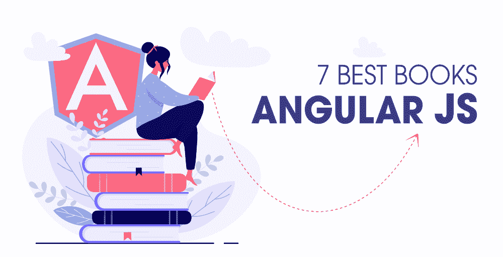

# 安古拉杰的 7 本最佳书籍

> 原文:[https://www.geeksforgeeks.org/7-best-books-for-angularjs/](https://www.geeksforgeeks.org/7-best-books-for-angularjs/)

在 web 开发中，有不同类型的框架用于不同的领域。作为一名网络开发人员，如果你正在寻找一些有助于学习前端框架的东西，尤其是 AngularJS，那么这篇文章就是为你准备的。但是在进入主题之前，让我们先来看看 AngularJS，这是一个基于 JavaScript 的前端 web 框架，用于构建 web 应用程序，称为 AngularJS。这是一个由谷歌开发和维护的开源网络框架。

所以，这里有一些最好的书，可以帮助你踏上学习 AngularJS 的旅程。

**1。** [**The ng-book:一本完整的关于棱角的书**](https://www.amazon.in/Ng-Book-Complete-Angular-Nathan-Murray/dp/1985170280)

这本书将带你从 Angular 的根到 Angular 框架的顶部，在其中学习最佳实践，构建大量的 Angular 示例应用程序，并获得对概念的深入理解。在这本书里，你将学习一些概念，比如测试，如何组织和简化你的应用程序，将组件应用到你的应用程序，等等。最棒的是，学习这本书不需要先了解 Angular 框架。跨过这本书的终点线后，你已经建立了一个坚实的 Angular 框架基础，可以将你的知识应用到你的 Angular 项目中。

**2。** [**棱角分明 5:从理论到实践**](https://www.amazon.in/Angular-Practice-applications-tomorrow-framework-ebook/dp/B01N9S0CZN)

如果你对网页开发知之甚少，对 ECMAScript 概念、HTML、CSS 和 JavaScript 知之甚少，并且想学习 Angular，那么这本书就是为你准备的。这本书将帮助您学习如何使用 TypeScript 和 Angular 命令行界面从头开始构建 Angular 应用程序。此外，您还将了解 ES6 JavaScript 和 TypeScript 的最新功能。它还将教你如何使用 RxJS 和 Observables 的反应式编程范例编写代码。

这本书包括:

*   Typescript & ES6 JavaScript
*   组件和绑定
*   角度命令行界面
*   单元测试
*   还有更多

**3。** [**棱角分明**](https://www.amazon.in/Angular-Action-Jeremy-Wilken/dp/1617293318)

这本书涵盖了基础知识以及高级概念，如测试、依赖注入和性能调优。要学习这本书，你应该熟悉 HTML、CSS 和 JavaScript。这本书将帮助您使用 TypeScript 和 ES2015 特性编写清晰、良好的架构代码。该应用程序为您提供了创建 web 应用程序的实用教程。书中提供的信息是由一位在这一领域有多年经验的人提供的，他名叫杰里米·威尔肯，是谷歌开发人员中的 Angular、web 技术和谷歌助手专家。

**4。** [**企业级网络应用的 Angular 6**](https://www.amazon.in/Angular-Enterprise-Ready-Web-Applications-production-ready-ebook/dp/B078PNWRDN)

在本书中，您将学习如何使用 Angular 和 RESTful APIs 构建全栈 web 应用程序。此外，您将探索看板方法、模型工具、角度内容、命令行界面工具、使用 RXJS 的反应式编程等等。当您深刻意识到这一点时，您也将理解路由器优先架构如何使用 Swagger 设计可靠的身份验证和授权、单元测试、后端 API。

总的来说，这是一本教你从设计到部署构建生产级 web 应用程序的好书。在本书结束后，您已经获得了 Angular 的丰富知识，以及云就绪型企业应用程序的知识。

**5。** [**角度:上升和运行**](https://www.amazon.in/Angular-Up-Running-Learning-Step-ebook/dp/B07DFTFMRK)

这本书将帮助你循序渐进地学习 Angular 核心概念，同时，你将处理有助于很好地解释概念的例子。通过这本书，您还将学习如何构建可扩展的角度应用程序。初学者学习棱角分明的好书。当你完成这本书的时候，你将对 angular 有一个很好的了解，你将能够构建你的 Angular 应用程序。

这本书涵盖–

*   创建和测试用于构建有效用户界面的角度组件
*   使用模板驱动的表单
*   角度服务
*   进行 HTTP 调用
*   按指定路线发送
*   还有更多

**6。** [**Pro Angular**](https://www.amazon.in/Pro-AngularJS-Experts-Voice-Development/dp/1430264489)

在这本书里，你将学习到被称为 MVC(模型-视图-控制器)的强大架构及其好处。这本书写得好，结构好，有助于清楚地理解概念。您还将学习如何使用 Angular 创建丰富且动态的网络应用客户端。这本书是为那些有基础网络开发知识并想学习 AngularJS 的人准备的。你也可以去找它的第三版和第四版的书。

**7。** [**带打字稿的棱角分明**](https://www.amazon.in/Angular-Development-TypeScript_p1-Yakov-Fain/dp/1617295345)

这本书是为熟悉 HTML、CSS 和 JavaScript 的网络开发人员编写的。通过这本书，您将了解 Angular 和 TypeScript 如何一起工作来创建 web 应用程序。在本书中，您将构建一个功能齐全的在线拍卖应用程序，该应用程序将教您许多有趣的概念，如状态管理、数据、表单、服务器通信等。这本书的知识是由经验丰富的教师和网络应用程序开发人员提供的，他们分别是雅科夫·费恩和安东·莫伊瑟夫。

最后，这些是 Angular 最好的书，现在是时候选择一本适合你需求的书了。要想在任何事情上变得更好，就要学习并实践它。