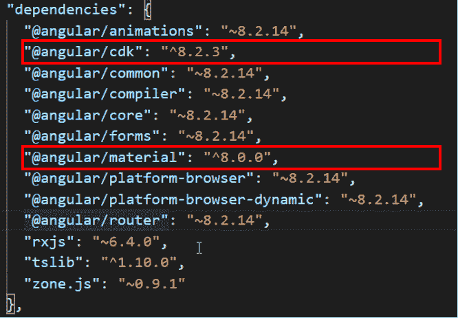
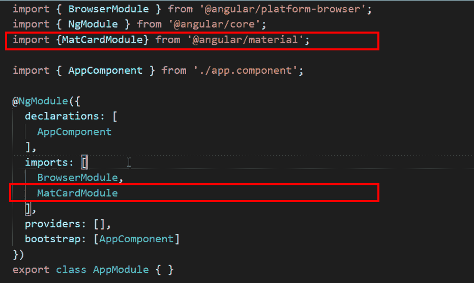

# 向角度应用添加角度材料成分

> 原文:[https://www . geesforgeks . org/add-angular-material-component-to-angular-application/](https://www.geeksforgeeks.org/adding-angular-material-component-to-angular-application/)

角度材质为角度提供设计组件。这是由 Angular Team 构建和维护的。这为 Angular 开发人员提供了通用的用户界面组件和工具，帮助他们构建自己的定制组件。作为用户，我们可以使用他们提供的 npm 包将其与我们的 Angular Application 集成。
角状物质也提供 CDK，以便整合共同的交互模式。

**提供的部分组件列表为:**

1.  表单控件
2.  航行
3.  布局
4.  按钮和指示器
5.  数据表
6.  弹出
7.  模型

**向应用中添加材料成分的步骤:**

*   [安装角度](https://www.geeksforgeeks.org/angular-7-installation/)
*   [创建角度命令行界面项目](https://www.geeksforgeeks.org/angular-cli-angular-project-setup/)
*   安装 Angular Material npm 包，并添加相应的 angular/cdk，因为 Angular Material 使用它并依赖它:

```
npm install --save angular-material
npm install --save @angular/cdk
```

*   该命令会将最新的 Angular Material Version 包添加到项目中，并且‘–save’会将依赖项添加到 package.json 文件中
    注意如果您想向 Angular 用户添加任何特定版本，请使用以下命令:

```
npm install --save angular-material@version
npm install --save @angular/cdk@version
```

*   要使用任何组件，请在应用程序模块文件中导入该组件
*   将导入的类添加到 app.module.ts @NgModule 部分的“导入”部分
*   现在，我们可以开始在我们的项目中使用它。
    为材料组件选择特定的选择器。
    转到 app.component.html 文件或要在其中添加材料组件的组件的另一个模板，向其中写入选择器代码。
*   保存所有文件，然后使用以下命令启动应用程序:

```
ng serve
```

*   这将减少您从基础开始实现组件的努力。

**向您的角度项目添加卡片组件的示例:**

*   安装角度
*   使用以下命令创建新的角度项目:

```
ng new GfGMaterialCardExample
```

*   您将被问及如下所示的两个问题:
    1.  是否要添加角度路由？
    2.  您希望使用哪种样式表格式？(使用箭头键)
*   更改目录级别，转到项目文件夹。

```
cd GfGMaterialCardExample
```

*   安装 Angular Material npm 软件包(@8.0.0 与 Angular 8 兼容，根据您使用的 Angular 版本添加 Angular 组件)，同时安装 Angular CDK:

```
npm install --save angular-material@8.0.0
npm install --save @angular/cdk@^8.2.3
```



*   将卡组件导入添加到应用模块文件，如下所示:



*   删除 app.component.html 文件中的所有样板代码，并添加以下代码:

```
 Geeks For Geeks - Angular Material Card Example 
```

*   在 app.component.css 文件中添加要应用的 CSS 代码:

```
mat-card {
    color: green;
    border:1px solid black;
}
```

*   使用服务命令启动应用程序:

