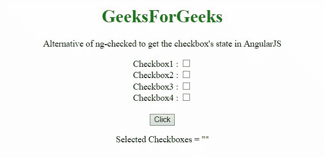

# 核取 ng 的替代选项，在 AngularJS

中获取复选框的状态

> 原文:[https://www . geesforgeks . org/alternative-of-ng-checked-get-the-checkbox-state-in-angularjs/](https://www.geeksforgeeks.org/alternative-of-ng-checked-to-get-the-checkboxs-state-in-angularjs/)

任务是在 AngularJS 的帮助下获取复选框的状态。

**进场:**

*   **ng-model** 用于获取选中的复选框。
*   只需为 ng 模型设置不同的值，这些值将用于检查元素是否被选中。
*   对于具有真实值的选定复选框，将弹出警报。

**例 1:**

## 超文本标记语言

```tshtml
<!DOCTYPE HTML>
<html>

<head>
    <script src=
"https://ajax.googleapis.com/ajax/libs/angularjs/1.2.13/angular.min.js">
    </script>

    <script>
        var myApp = angular.module("app", []);
        myApp.controller("controller", function ($scope) {
            $scope.selCheckboxes = '';
            $scope.getSelCheckB = function (myCheckbox) {
                alert(JSON.stringify(myCheckbox));
            };
        });
    </script>
</head>

<body style="text-align:center;">
    <h1 style="color:green;">
        GeeksForGeeks
    </h1>

    <p>
        Alternative of ng-checked to get 
        the checkbox's state in AngularJS
    </p>

    <div ng-app="app">
        <div ng-controller="controller">
            <form action="javascript:void(0)">
                Checkbox1 :
                <input type="checkbox" 
                    name="checkbox1" 
                    ng-model='myCheckbox.val1' />
                <br />
                Checkbox2 :
                <input type="checkbox" 
                    name="checkbox2" 
                    ng-model='myCheckbox.val2' /><br />
                Checkbox3 :
                <input type="checkbox" 
                    name="checkbox3" 
                    ng-model='myCheckbox.val3' /><br />
                Checkbox4 :
                <input type="checkbox" 
                    name="checkbox4" 
                    ng-model='myCheckbox.val4' /><br />
                <br>

                <button ng-click="getSelCheckB(myCheckbox)">
                    Click
                </button>
            </form>
        </div>
    </div>
</body>

</html>
```

**输出:**

*   **点击按钮前:**


*   **点击按钮后:**


**例 2:**

## 超文本标记语言

```tshtml
<!DOCTYPE HTML>
<html>

<head>
    <script src=
"https://ajax.googleapis.com/ajax/libs/angularjs/1.2.13/angular.min.js">
    </script>

    <script>
        var myApp = angular.module("app", []);
        myApp.controller("controller", function ($scope) {
            $scope.selCheckboxes = '';
            $scope.getSelCheckB = function (myCheckbox) {
                $scope.selCheckboxes 
                    = angular.copy(myCheckbox);
            };
        });
    </script>
</head>

<body style="text-align:center;">
    <h1 style="color:green;">
        GeeksForGeeks
    </h1>

    <p>
        Alternative of ng-checked to get the 
        checkbox's state in AngularJS
    </p>

    <div ng-app="app">
        <div ng-controller="controller">
            <form action="javascript:void(0)">
                Checkbox1 :
                <input type="checkbox" 
                    name="checkbox1" 
                    ng-model='myCheckbox.val1' />
                <br />
                Checkbox2 :
                <input type="checkbox" 
                    name="checkbox2" 
                    ng-model='myCheckbox.val2' /><br />
                Checkbox3 :
                <input type="checkbox" 
                    name="checkbox3" 
                    ng-model='myCheckbox.val3' /><br />
                Checkbox4 :
                <input type="checkbox" 
                    name="checkbox4" 
                    ng-model='myCheckbox.val4' /><br />
                <br>

                <button ng-click="getSelCheckB(myCheckbox)">
                    Click
                </button>
            </form>

            <p>Selected Checkboxes = {{selCheckboxes | json}}</p>
        </div>
    </div>
</body>

</html>
```

**输出:**

