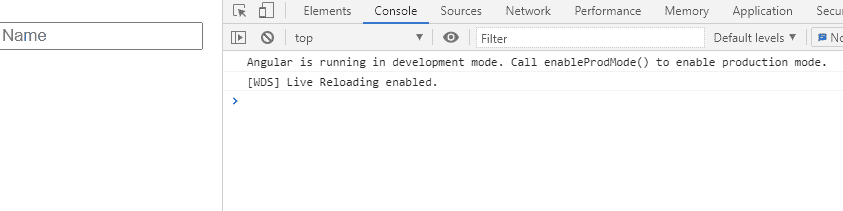
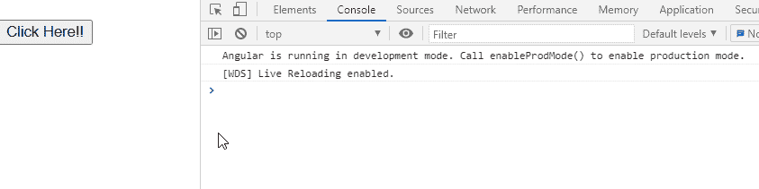

# 角度 10(模糊)事件

> 原文:[https://www.geeksforgeeks.org/angular-10-blur-event/](https://www.geeksforgeeks.org/angular-10-blur-event/)

在本文中，我们将看到什么是 Angular 10 中的模糊事件，以及如何使用它。当元素失去焦点时，会触发模糊事件。

**语法:**

```
<input (blur)='functionName()'/>
```

**模糊事件使用的模块是:**

*   **公共模块**

**进场:**

*   创建一个要使用的角度应用程序。
*   在 app.component.ts 中，创建一个在模糊事件时触发的函数。
*   在 app.component.html，制作一个输入元素并设置模糊事件。
*   使用 ng serve 为 angular app 服务，以查看输出。

**例 1:**

## app.component.ts

```
import { Component } from '@angular/core';

@Component({
    selector: 'app-root',
    templateUrl: './app.component.html',
    styleUrls: ['./app.component.css']
})

export class AppComponent {
    onBlur(): void {
        console.log('Focus Is Lost for this Element');
    }
}
```

## app.component.html

```
<br>
<form>
    <input placeholder="Name" (blur) = 'onBlur()'>
</form>
```

**输出:**



**例 2:**

## app.component.ts

```
import { Component } from '@angular/core';

@Component({
    selector: 'app-root',
    templateUrl: './app.component.html',
    styleUrls: ['./app.component.css']
})

export class AppComponent {
    onBlur(): void {
        console.log('Focus Is Lost for this Element');
    }
}
```

## app.component.html

```
<br>
<form>
    <button  (blur) = 'onBlur()'>Click Here!!</button>
</form>
```

**输出:**

