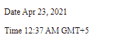
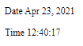

# 角 10 DatePipe API

> 原文:[https://www.geeksforgeeks.org/angular-10-datepipe-api/](https://www.geeksforgeeks.org/angular-10-datepipe-api/)

在本文中，我们将看到什么是 Angular 10 中的 **DatePipe** 以及如何使用它。

DatePipe 用于根据区域设置规则格式化日期值。

**语法:**

```
{{ value | date }}
```

**进场:**

*   创建要使用的角度应用程序。
*   使用日期管道不需要任何导入。
*   在 app.component.ts 中定义接受日期值的变量。
*   在 app.component.html，使用上面的语法来制作日期元素。
*   使用 ng serve 为 angular app 服务，以查看输出。

**参数:**

*   **格式:**取一个字符串值。
*   **时区:**取字符串值。
*   **区域设置:**它采用字符串值。

**例 1:**

## app.component.ts

```
import { Component, OnInit } 
from '@angular/core';

@Component({
    selector: 'app-root',
    templateUrl: './app.component.html'
})
export class AppComponent {
    today: number = Date.now();
}
```

## app.component.html

```
<p>Date {{today | date}}</p>

<p>Time {{today | date:'h:mm a z'}}</p>
```

**输出:**



**例 2:**

## app.component.ts

```
import { Component } from '@angular/core';

@Component({
    selector: 'app-root',
    templateUrl: './app.component.html'
})
export class AppComponent {
    today: number = Date.now();
}
```

## app.component.html

```
<p>Date {{today | date}}</p>

<p>Time {{today | date:'h:m:s'}}</p>
```

**输出:**

