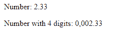
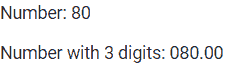

# 角度 10°半角管道 API

> 原文:[https://www.geeksforgeeks.org/angular-10-demicalpipe-api/](https://www.geeksforgeeks.org/angular-10-demicalpipe-api/)

在本文中，我们将看到什么是 Angular 10 中的**半管道**以及如何使用它。分层管道用于根据数字选项和区域设置规则格式化值。

**语法:**

```
{{ value | number}}
```

**模块:**抽取管道使用的模块是:

*   **公共模块**

**进场:**

*   创建一个要使用的角度应用程序。
*   使用抽取管道不需要任何导入。
*   在 app.component.ts 中定义接受十进制值的变量。
*   在 app.component.html，使用上面的语法来创建日期元素。
*   使用 ng serve 为 angular app 服务，以查看输出。

**参数:**

*   **Value:** 取一个字符串值，根据使用十进制管道的条件转换为十进制。

**例 1:**

## app.component.ts

```
import { Component, OnInit } from '@angular/core';

@Component({
    selector: 'app-root',
    templateUrl: './app.component.html'
})
export class AppComponent {
    pi: number = 2.33;
}
```

## app.component.html

```
<p>
    Number:
    {{pi | number}}
</p>

<p>
    <!-- In this '4.1-5' means 4 digits before . 
         and 1-5 digits after . depending
         upon given digit -->
    Number with 4 digits:
    {{pi | number:'4.1-5'}}
</p>
```

**输出:**



**例 2:**

## app.component.ts

```
import { Component, LOCALE_ID } from '@angular/core';

@Component({
    selector: 'app-root',
    templateUrl: './app.component.html'
})
export class AppComponent {
    num: number = 20*4;
}
```

## app.component.html

```
<p>
    Number:
    {{num | number}}
</p>

<p>
    <!-- In this '4.2' means 3 digits before . 
         and 2 digits after . which is 80-->
    Number with 3 digits:
    {{num | number:'3.2'}}
</p>
```

**输出:**



**参考:**T2】https://angular.io/api/common/DecimalPipe