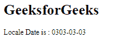

# 角度 10 格式化日期()方法

> 原文:[https://www.geeksforgeeks.org/angular-10-formatdate-method/](https://www.geeksforgeeks.org/angular-10-formatdate-method/)

在本文中，我们将看到什么是 Angular 10 中的 formatDate 以及如何使用它。**格式化日期**用于根据地区规则格式化日期。

**语法:**

```
formatDate(value, locale, format, timezone)
```

**参数:**

*   **值:** 要格式化的数字。
*   **地区:** 地区格式的地区代码。
*   **格式:** 要包含的日期时间成分。
*   **时区:** 该地的时区。

**返回值:**

*   **字符串:**格式化的日期字符串。

**模块:**format date 使用的模块为:

*   **公共模块**

**进场:**

*   创建要使用的角度应用程序。
*   在 app.module.ts 中导入 LOCALE_ID，因为我们需要使用 get formatDate 导入 LOCALE。

```
import { LOCALE_ID, NgModule } from '@angular/core';
```

*   在 app.component.ts 中导入 formatDate 和 LOCALE_ID
*   将 LOCALE_ID 作为公共变量注入。
*   在 app.component.html，使用字符串插值显示局部变量
*   使用 ng serve 为 angular app 服务，以查看输出。

**例 1:**

## app.component.ts

```
import {
  formatDate
 }
  from '@angular/common';

import {Component,
  Inject,
  LOCALE_ID }
  from '@angular/core';

@Component({
selector: 'app-root',
templateUrl: './app.component.html'
})
export class AppComponent {
curr = formatDate("02-feburary-0202", 'dd-MM-yyyy' ,this.locale);
constructor(
  @Inject(LOCALE_ID) public locale: string,){}
}
```

## app.component.html

```
<h1>
  GeeksforGeeks
</h1>

<p>Locale Date is : {{curr}}</p>
```

**输出:**


**例 2:**

## app.component.ts

```
import {
  formatDate
 }
  from '@angular/common';

import {Component,
  Inject,
  LOCALE_ID }
  from '@angular/core';

@Component({
selector: 'app-root',
templateUrl: './app.component.html'
})
export class AppComponent {
curr = formatDate("03-march-0303", 'yyyy-dd-MM' ,this.locale);
constructor(
  @Inject(LOCALE_ID) public locale: string,){}
}
```

## app.component.html

```
<h1>
  GeeksforGeeks
</h1>

<p>Locale Date is : {{curr}}</p>
```

**输出:**



**参考:**T2**https://angular.io/api/common/formatDate**T5】