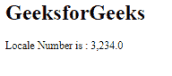

# 角度 10 格式化数()方法

> 原文:[https://www . geesforgeks . org/angular-10-format number-method/](https://www.geeksforgeeks.org/angular-10-formatnumber-method/)

在本文中，我们将看到什么是 Angular 10 中的 formatNumber 以及如何使用它。

**格式化数字**用于根据我们对十进制形式的要求对数字进行格式化。

**语法:**

```
formatNumber(value, locale, digitsInfo)
```

**参数:**

*   **值:** 要格式化的数字。
*   **地区:** 地区格式的地区代码。
*   **数字信息:** 十进制表示选项。

**返回值:**

*   **字符串:**格式化的文本字符串。

**模块:**格式号使用的模块为:

*   **公共模块**

**进场:**

*   创建要使用的角度应用程序。
*   在 app.module.ts 中导入 LOCALE_ID，因为我们需要使用 get formatNumber 导入 LOCALE。

    ```
    import { LOCALE_ID, NgModule } from '@angular/core';
    ```

*   在 app.component.ts 中导入 formatNumber 和 LOCALE_ID
*   将 LOCALE_ID 作为公共变量注入。
*   在 app.component.html，使用字符串插值显示局部变量
*   使用 ng serve 为 angular app 服务，以查看输出。

**例 1:**

## app.component.ts

```
import {
  formatNumber
 }
  from '@angular/common';

import {Component,
  Inject,
  LOCALE_ID }
  from '@angular/core';

@Component({
selector: 'app-root',
templateUrl: './app.component.html'
})
export class AppComponent {
curr = formatNumber(1000,this.locale,
          '7.1-5');
constructor(
  @Inject(LOCALE_ID) public locale: string,){}
}
```

## app.component.html

```
<h1>
  GeeksforGeeks
</h1>

<p>Locale Number is : {{curr}}</p>
```

**输出:**


**例 2:**

## app.component.ts

```
import {
  formatNumber
 }
  from '@angular/common';

import {Component,
  Inject,
  LOCALE_ID }
  from '@angular/core';

@Component({
selector: 'app-root',
templateUrl: './app.component.html'
})
export class AppComponent {
curr = formatNumber(100,this.locale,
          '2.1-5');
constructor(
  @Inject(LOCALE_ID) public locale: string,){}
}
```

## app.component.html

```
<h1>
  GeeksforGeeks
</h1>

<p>Locale Number is : {{curr}}</p>
```

**输出:**


**例 3:**

## app.component.ts

```
import {
  formatNumber
 }
  from '@angular/common';

import {Component,
  Inject,
  LOCALE_ID }
  from '@angular/core';

@Component({
selector: 'app-root',
templateUrl: './app.component.html'
})
export class AppComponent {
curr = formatNumber(3234,this.locale,
          '3.1-4');
constructor(
  @Inject(LOCALE_ID) public locale: string,){}
}
```

## app.component.html

```
<h1>
  GeeksforGeeks
</h1>

<p>Locale Number is : {{curr}}</p>
```

**输出:**



**参考:**T2**https://angular.io/api/common/formatNumber**T5】