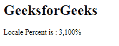

# 角度 10 格式化百分比()方法

> 原文:[https://www . geesforgeks . org/angular-10-format percent-method/](https://www.geeksforgeeks.org/angular-10-formatpercent-method/)

在本文中，我们将了解什么是 Angular 10 中的 formatPercent，以及如何使用它。**格式化百分比**用于根据区域设置规则将数字格式化为百分比。

**语法:**

```ts
formatPercent(value, locale, digitsInfo)
```

**参数:**

*   **值:** 要格式化的数字。
*   **地区:** 地区格式的地区代码。
*   **数字信息:** 十进制表示选项。

**返回值:**

*   **字符串:**格式化的百分比字符串。

**模块:**format percent 使用的模块为:

*   **公共模块**

**进场:**

*   创建要使用的角度应用程序。
*   在 app.module.ts 中导入 LOCALE_ID，因为我们需要使用 get formatPercent 导入区域设置。

```ts
import { LOCALE_ID, NgModule } from '@angular/core';
```

*   在 app.component.ts 导入格式百分比 Zand LOCALE_ID
*   将 LOCALE_ID 作为公共变量注入。
*   在 app.component.html，使用字符串插值显示局部变量
*   使用 ng serve 为 angular app 服务，以查看输出。

**例 1:**

## app.component.ts

```ts
import {
  formatPercent
 }
  from '@angular/common';

import {Component,
  Inject,
  LOCALE_ID }
  from '@angular/core';

@Component({
selector: 'app-root',
templateUrl: './app.component.html'
})
export class AppComponent {
curr = formatPercent(31,this.locale,
          '3.0-4');
constructor(
  @Inject(LOCALE_ID) public locale: string,){}
}
```

## app.component.html

```ts
<h1>
  GeeksforGeeks
</h1>

<p>Locale Percent is : {{curr}}</p>
```

**输出:**



**例 2:**

## app.component.ts

```ts
import {
  formatPercent
 }
  from '@angular/common';

import {Component,
  Inject,
  LOCALE_ID }
  from '@angular/core';

@Component({
selector: 'app-root',
templateUrl: './app.component.html'
})
export class AppComponent {
curr = formatPercent(31,this.locale,
          '3.2-4');
constructor(
  @Inject(LOCALE_ID) public locale: string,){}
}
```