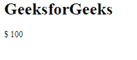
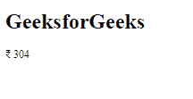

# 角度 10 获取电流符号()方法

> 原文:[https://www . geesforgeks . org/angular-10-getcurrency symbol-method/](https://www.geeksforgeeks.org/angular-10-getcurrencysymbol-method/)

在本文中，我们将看到 Angular 10 中的 getCurrencySymbol 是什么，以及如何使用它。 **getCurrencySymbol** 用于为给定的货币代码设置货币符号

**语法:**

```
getCurrencySymbol(code, locale, format)
```

**参数:**

*   **代码:** 货币代码
*   **地区:** 要使用的地区格式规则的地区代码。
*   **格式:** 格式。

**返回值:**

*   **字符串:**格式化的日期字符串。

**模块:**getcurrency symbol 使用的模块为:

*   **公共模块**

**进场:**

*   创建要使用的角度应用程序。
*   在 app.module.ts 中导入 LOCALE_ID，因为我们需要为使用 getCurrencySymbol 导入 LOCALE。

```
import { LOCALE_ID, NgModule } from '@angular/core';
```

*   在 app.component.ts 中导入 getCurrencySymbol 和 LOCALE_ID
*   将 LOCALE_ID 作为公共变量注入。
*   在 app.component.html，使用字符串插值显示局部变量
*   使用 ng serve 为 angular app 服务，以查看输出。

**例 1:**

## app.component.ts

```
import {
  getCurrencySymbol
 }
  from '@angular/common';

import {Component}
  from '@angular/core';

@Component({
selector: 'app-root',
templateUrl: './app.component.html'
})
export class AppComponent {
curr = getCurrencySymbol("USD", "wide");
}
```

## app.component.html

```
<h1>
  GeeksforGeeks
</h1>

<p>{{curr }} 100</p>
```

**输出:**



**例 2:**

## app.component.ts

```
import {
  getCurrencySymbol
 }
  from '@angular/common';

import {Component}
  from '@angular/core';

@Component({
selector: 'app-root',
templateUrl: './app.component.html'
})
export class AppComponent {
curr = getCurrencySymbol("INR", "narrow");
}
```

## app.component.html

```
<h1>
  GeeksforGeeks
</h1>

<p>{{curr }} 304</p>
```

**输出:**



**参考:**T2**https://angular.io/api/common/getCurrencySymbol**T5】