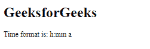
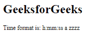

# Angular 10 getLocaleTimeFormat()函数

> 原文:[https://www . geeksforgeeks . org/angular-10-getlocaletimeformat-function/](https://www.geeksforgeeks.org/angular-10-getlocaletimeformat-function/)

getLocaleTimeFormat 用于获取给定区域设置的本地化时间值格式。

**语法:**

```
getLocaleTimeFormat(locale: string, width: FormatWidth): string
```

**模块:**getLocaleTimeFormat 使用的模块为:

*   **公共模块**

**进场:**

*   创建要使用的角度应用程序
*   在 app.module.ts 中导入 LOCALE_ID，因为我们需要使用 getLocaleTimeFormat 导入区域设置。

    ```
    import { LOCALE_ID, NgModule } from '@angular/core';
    ```

*   在 app.component.ts 中导入 getLocaleTimeFormat 和 LOCALE_ID
*   将 LOCALE_ID 作为公共变量注入。
*   在 app.component.html，使用字符串插值显示局部变量
*   使用 ng serve 为 angular app 服务，以查看输出。

**参数:**

*   **区域设置:**包含带有规则的区域设置代码的字符串。
*   **宽度:**日期时间格式可用的字符串宽度。

**返回值:**

*   **字符串:**本地化格式字符串的字符串。

**例 1:**

## app.module.ts

```
import { LOCALE_ID, NgModule } from '@angular/core';
import { BrowserModule } from '@angular/platform-browser';

import { AppRoutingModule } from './app-routing.module';
import { AppComponent } from './app.component';

@NgModule({
  declarations: [
    AppComponent
  ],
  imports: [
    BrowserModule,
    AppRoutingModule
  ],
  providers: [
      { provide: LOCALE_ID, useValue: 'en-GB' },
  ],
  bootstrap: [AppComponent]
})
export class AppModule { }
```

## app.component.ts

```
import {FormStyle,
        getLocaleTimeFormat, TranslationWidth, 
        FormatWidth} from '@angular/common';

import { Component, Inject,OnInit, LOCALE_ID } from '@angular/core';

@Component({
    selector: 'app-root',
    templateUrl: './app.component.html'
})
export class AppComponent {
    for = getLocaleTimeFormat(this.locale, FormatWidth.Short);
    constructor(
        @Inject(LOCALE_ID) public locale: string,){}
      }
```

## app.component.html

```
<h1>
   GeeksforGeeks
 </h1>

<p>Time format is: {{for}}</p>
```

**输出:**



**例 2:**

## app.module.ts

```
import { LOCALE_ID, NgModule } from '@angular/core';
import { BrowserModule } from '@angular/platform-browser';

import { AppRoutingModule } from './app-routing.module';
import { AppComponent } from './app.component';

@NgModule({
  declarations: [
    AppComponent
  ],
  imports: [
    BrowserModule,
    AppRoutingModule
  ],
  providers: [
      { provide: LOCALE_ID, useValue: 'en-GB' },
  ],
  bootstrap: [AppComponent]
})
export class AppModule { }
```

## app.component.ts

```
import {FormStyle,
        getLocaleTimeFormat, TranslationWidth, 
        FormatWidth} from '@angular/common';

import { Component, Inject,OnInit, LOCALE_ID } from '@angular/core';

@Component({
    selector: 'app-root',
    templateUrl: './app.component.html'
})
export class AppComponent {
    for = getLocaleTimeFormat(this.locale,     FormatWidth.Full);
    constructor(
        @Inject(LOCALE_ID) public locale: string,){}
      }
```

## app.component.html

```
<h1>
   GeeksforGeeks
 </h1>

<p>Time format is: {{for}}</p>
```

**输出:**



**参考:**[](https://angular.io/api/common/getLocaleCurrencyName)**[https://angular.io/api/common/getLocaleTimeFormat](https://angular.io/api/common/getLocaleTimeFormat)**