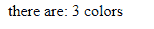
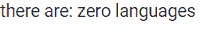

# 角 10i 18 nplurpipe API

> 原文:[https://www . geeksforgeeks . org/angular-10-i18n plural pipe-API/](https://www.geeksforgeeks.org/angular-10-i18npluralpipe-api/)

在这篇文章中，我们将看到什么是 Angular 10 中的**i18n 管道**以及如何使用它。I18nPluralPipe 是一个根据给定规则取复数形式的字符串值的映射。

**语法:**

```ts
{{ value |  i18nPlural : map [ : rule]}}
```

**模块:**i18n 管道使用的模块是:

*   **公共模块**

**进场:**

*   创建要使用的角度应用程序。
*   不需要任何导入就可以使用 i18n 管道。
*   在 app.component.ts 中，定义采用 I18nPluralPipe 值的变量。
*   在 app.component.html，使用上面带有“|”符号的语法来创建 i18n 管道元素。
*   使用 ng serve 为 angular app 服务，以查看输出。

**输入值:**

*   **值:**取一个数值**。**

**参数:**

*   **pluralpmap:**需要一个对象值。
*   **区域设置:**它采用字符串值。

**例 1:**

## app.component.ts

```ts
import { Component, OnInit } from '@angular/core';

@Component({
    selector: 'app-root',
    templateUrl: './app.component.html'
})
export class AppComponent {

    // Color array
    colors: any[] = ['red','green','blue'];

    // Map from which I18nPluralPipe takes the value
    gfg:
        {[k: string]: string} = {
            '=0': 'No color', 
            '=1': 'one color',  
            'other': '# colors'
        };
}
```

## app.component.html

```ts
<!-- In Below Code I18nPluralPipe is used -->
<div>there are: {{ colors.length | i18nPlural: gfg }}</div>
```

**输出:**



**例 2:**

## app.component.ts

```ts
import { Component } from '@angular/core';

@Component({
    selector: 'app-root',
    templateUrl: './app.component.html'
})
export class AppComponent {

    // Language array
    language: any[] = [];

    // Map from which I18nPluralPipe
    // takes the value
    gfg:
        {[k: string]: string} = {
            '=0': 'zero languages', 
            '=1': 'one language',
            'other': '# languages'
        };
}
```

## app.component.html

```ts
<!-- In Below Code I18nPluralPipe is used -->
<div>there are: {{ language.length | i18nPlural: gfg }}</div>
```

**输出:**



**参考:**T2】https://angular.io/api/common/I18nPluralPipe