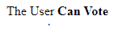
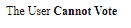

# 角 10i18 管 API

> 原文:[https://www . geesforgeks . org/angular-10-i18n selectpipe-API/](https://www.geeksforgeeks.org/angular-10-i18nselectpipe-api/)

在本文中，我们将看到什么是 Angular 10 中的**i18n 选择管道**以及如何使用它。

i18n 选择管道是一个选择器，用于显示与当前值匹配的字符串。

**语法:**

```
{{ value | i18nSelect : map}}
```

**模块:**i18n 选择管使用的模块是:

*   **公共模块**

**进场:**

*   创建要使用的角度应用程序。
*   不需要任何导入就可以使用 I18nSelectPipe。
*   在 app.component.ts 中，定义采用 I18nSelectPipe 值的变量。
*   在 app.component.html，使用上面带有“|”符号的语法来创建 i18n 选择管道元素。
*   使用 ng serve 为 angular app 服务，以查看输出。

**输入值:**

*   **值:**取一个字符串值**。**

**参数:**

*   **映射:**取一个对象值，表示不同值应该显示的文本。

**例 1:**

## app.component.ts

```
import { Component, OnInit } 
from '@angular/core';

@Component({
    selector: 'app-root',
    templateUrl: './app.component.html'
})
export class AppComponent {
    // Age Variable
    age : string = 'twenty';

    // Map from which I18nSelectPipe takes the value
    votin : any =
    {'twenty': 'Can Vote', 'seventeen':'Cannot Vote'};}
```

## app.component.html

```
<!-- In Below Code I18nSelectPipe is used -->
<div>The User <b>{{age | i18nSelect: votin}}</b> </div>
```

**输出:**



**例 2:**

## app.component.ts

```
import { Component, OnInit }
from '@angular/core';

@Component({
    selector: 'app-root',
    templateUrl: './app.component.html'
})
export class AppComponent {
    // Age Variable
    age : string = 'seventeen';

    // Map from which I18nSelectPipe takes the value
    votin : any = 
    {'twenty': 'Can Vote', 'seventeen':'Cannot Vote'};}
```

## app.component.html

```
<!-- In Below Code I18nSelectPipe is used -->
<div>The User <b>{{age | i18nSelect: votin}}</b> </div>
```

**输出:**



**参考:**T2】https://angular.io/api/common/I18nSelectPipe