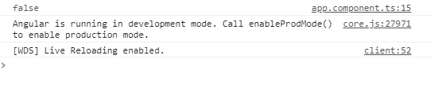

# Angular 10 isplatformworkrapp API

> 原文:[https://www . geesforgeks . org/angular-10-isplatformworkrapp-API/](https://www.geeksforgeeks.org/angular-10-isplatformworkerapp-api/)

在本文中，我们将看到 Angular 10 中的**是什么以及如何使用它。isPlatformWorkerApp API 用于获取表示工作应用程序平台的平台 id。**

**语法:**

```
isPlatformWorkerApp( platformId );
```

**模块:**isplatformworkrapp 使用的模块是:

*   **公共模块**

**返回值:**返回一个布尔值，说明平台 id 是否代表工作应用平台。

**进场:**

*   创建要使用的 Angular 应用程序。
*   将 isPlatformWorkerApp 从@angular/core 导入项目。
*   在 app.component.ts 中，定义保存布尔值的对象。
*   使用 ng serve 为 angular app 服务，以查看输出。

**例 1:**

## app.component.ts

```
import { Component, Inject } from '@angular/core';
import { PLATFORM_ID } from '@angular/core';
import { isPlatformWorkerUi } from '@angular/common';

@Component({
  selector: 'app-root',
  templateUrl: './app.component.html',
  styleUrls: [ './app.component.css' ]
})
export class AppComponent  {
    isWorker: boolean;

    constructor( @Inject(PLATFORM_ID) platformId: Object) {
      this.isWorker = isPlatformWorkerUi(platformId);
      console.log(this.isWorker);
    }
  }
```

**输出:**



**例 2:**

## app.component.ts

```
import { Component, Inject } from '@angular/core';
import { PLATFORM_ID } from '@angular/core';
import { isPlatformWorkerUi } from '@angular/common';

@Component({
  selector: 'app-root',
  templateUrl: './app.component.html',
  styleUrls: [ './app.component.css' ]
})
export class AppComponent  {
    isWorker: boolean;

    constructor( @Inject(PLATFORM_ID) platformId: Object) {
      this.isWorker = isPlatformWorkerUi(platformId);
    }
  }
```

## app.component.html

```
<div *ngIf = 'isWorker==false'>
      platform id does not represents a web worker UI platform.
</div>
```

**输出:**


**参考:**T2】https://angular.io/api/common/isPlatformWorkerApp