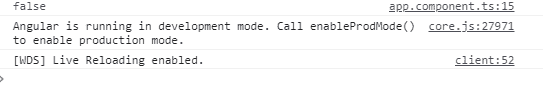

# Angular 10 isplatformworkrui API

> 原文:[https://www . geesforgeks . org/angular-10-isplatformworkrui-API/](https://www.geeksforgeeks.org/angular-10-isplatformworkerui-api/)

在本文中，我们将看到什么是 Angular 10 中的**isplatformworkrui**以及如何使用它。isPlatformWorkerUi 应用编程接口用于获取一个平台 id，该 id 代表一个网络工作用户界面平台。

**语法:**

```ts
isPlatformWorkerUi( platformId );
```

**模块:**isplatformworkrui 使用的模块是:

*   **公共模块**

**返回值:**返回一个布尔值，说明平台 id 是否代表一个 web worker UI 平台。

**进场:**

*   创建一个要使用的角度应用程序。
*   将 isPlatformWorkerUi 从@angular/core 导入到项目。
*   在 app.component.ts 中，定义保存布尔值的对象。
*   使用 ng serve 为 angular app 服务，以查看输出。

**例 1:**

## app.component.ts

```ts
import { Component, Inject } from '@angular/core';
import { PLATFORM_ID } from '@angular/core';
import { isPlatformWorkerApp } from '@angular/common';

@Component({
  selector: 'app-root',
  templateUrl: './app.component.html',
  styleUrls: [ './app.component.css' ]
})
export class AppComponent  {
  isWorkerApp: boolean;

  constructor( @Inject(PLATFORM_ID) platformId: Object) {
    this.isWorkerApp = isPlatformWorkerApp(platformId);
    console.log(this.isWorkerApp);
  }
}
```

**输出:**



**例 2:**

## app.component.ts

```ts
import { Component, Inject } from '@angular/core';
import { PLATFORM_ID } from '@angular/core';
import { isPlatformWorkerApp } from '@angular/common';

@Component({
  selector: 'app-root',
  templateUrl: './app.component.html',
  styleUrls: [ './app.component.css' ]
})
export class AppComponent  {
  isWorkerApp: boolean;

  constructor( @Inject(PLATFORM_ID) platformId: Object) {
    this.isWorkerApp = isPlatformWorkerApp(platformId);
  }
}
```

## app.component.html

```ts
<div *ngIf = 'isWorkerApp==false'>
    platform id does not represents a web worker UI platform.
</div>
```

**输出:**


**参考:**T2】https://angular.io/api/common/isPlatformWorkerUi