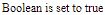
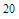

# 角度 10 NgIf 指令

> 原文:[https://www.geeksforgeeks.org/angular-10-ngif-directive/](https://www.geeksforgeeks.org/angular-10-ngif-directive/)

在这篇文章中，我们将看到什么是 Angular 10 中的 **NgIf** 以及如何使用它。

angular 10 中的 **ngIf 指令** 用于根据表达式移除或重新创建 HTML 元素的一部分。如果其中的表达式为假，则删除该元素，如果为真，则将该元素添加到 DOM 中。

**语法:**

```ts
<li *ngIf='condition'></li>
```

**NgIf 使用的模块:**NgIf 使用的模块是:

*   **公共模块**

**选择器:**

**进场:**

*   创建一个要使用的角度应用程序。
*   使用 **NgIf** 不需要任何进口。
*   在 app.component.ts 中，定义要用 **ngIf** 指令检查条件的变量。
*   在 app.component.html，使用带有待检查条件的 NgIf 指令。
*   使用 ng serve 为 angular app 服务，以查看输出。

**例 1:**

## app.component.ts

```ts
import { Component, Inject } from '@angular/core';
import { PLATFORM_ID } from '@angular/core';
import { isPlatformWorkerApp } from '@angular/common';

@Component({
  selector: 'app-root',
  templateUrl: './app.component.html',
  styleUrls: [ './app.component.css' ]
})

  export class AppComponent  {
    myBool = true;
  }
```

## app.component.html

```ts
<div *ngIf = 'myBool'>Boolean is set to true</div>
```

**输出:**



**例 2:**

## java 描述语言

```ts
import { Component, Inject } from '@angular/core';
import { PLATFORM_ID } from '@angular/core';
import { isPlatformWorkerApp } from '@angular/common';

@Component({
  selector: 'app-root',
  templateUrl: './app.component.html',
  styleUrls: [ './app.component.css' ]
})
export class AppComponent  {
  variab = 10;
}
```

## app.component.html

```ts
<div *ngIf = 'variab==1; else multi'>{{variab}}</div>

<ng-template #multi>
    {{variab *2}}
  </ng-template>
```

**输出:**



**参考:**T2】https://angular.io/api/common/NgIf