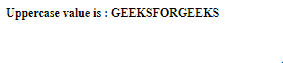
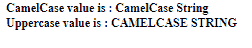

# 角度 10°上半部分

> 原文:[https://www.geeksforgeeks.org/angular-10-uppercasepipe/](https://www.geeksforgeeks.org/angular-10-uppercasepipe/)

在本文中，我们将看到什么是 Angular 10 中的**upper seppe**以及如何使用它。

上半部分用于将所有文本转换为大写。

**语法:**

```ts
{{ value | uppercase }}
```

**模块:**上层使用的模块是:

*   **公共模块**

**进场:**

*   创建要使用的角度应用程序
*   不需要任何导入就可以使用上半部分
*   在 app.component.ts 中，定义接受 UpperCasePipe 值的变量。
*   在 app.component.html，使用上面带有“|”符号的语法来构成 UpperCasePipe 元素。
*   使用 ng serve 为 angular app 服务，以查看输出

**输入值:**

*   **值:**取一个字符串值。

**例 1:**

## app.component.ts

```ts
import { Component, OnInit }
        from '@angular/core';

@Component({
    selector: 'app-root',
    templateUrl: './app.component.html'
})
export class AppComponent {
    // Key Value object
    value : string = 'geeksforgeeks';
  }
```

## app.component.html

```ts
<b>
  <div>
    Uppercase value is :
    {{value | uppercase}}
  </div>
</b>
```

**输出:**



**例 2:**

## app.component.ts

```ts
import { Component, OnInit } 
        from '@angular/core';

@Component({
    selector: 'app-root',
    templateUrl: './app.component.html'
})
export class AppComponent {
    value : string = 'CamelCase String';
  }
```

## app.component.html

```ts
<b>
  <div>
    CamelCase value is : 
    {{value}}
  </div>
  <div>
    Uppercase value is : 
    {{value | uppercase}}
  </div>
</b>
```

**输出:**



**参考:**T2】https://angular.io/api/common/UpperCasePipe