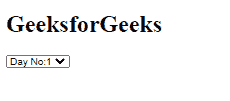

# 角度 10 周 API

> 原文:[https://www.geeksforgeeks.org/angular-10-weekday-api/](https://www.geeksforgeeks.org/angular-10-weekday-api/)

在本文中，我们将看到 Angular 10 中的 WeekDay 是什么，以及如何使用它。Angular10 中的 **WeekDay** API 用于获取一周中每一天的值。

**语法:**

```
enum WeekDay {
  Sunday: 0
  Monday
  Tuesday
  Wednesday
  Thursday
  Friday
  Saturday
}
```

**模块:**WeekDay 使用的模块为:

*   **公共模块**

**进场:**

*   创建一个要使用的角度应用程序。
*   将 WeekDay 导入您的 app.component.ts 文件。
*   在 app.component.ts 中定义星期几变量
*   在 app.component.html，使用 weekDay 变量获取星期几的索引值。
*   使用 ng serve 为 angular app 服务，以查看输出。

**示例:**

## app.component.ts

```
import { Component, Inject } from '@angular/core';
import { PLATFORM_ID } from '@angular/core';
import { WeekDay } from '@angular/common';
import { isPlatformWorkerApp } from '@angular/common';

@Component({
  selector: 'app-root',
  templateUrl: './app.component.html',
  styleUrls: [ './app.component.css' ]
})
export class AppComponent  {
  public weekDays: WeekDay[] = [
      WeekDay.Monday, 
      WeekDay.Tuesday, 
      WeekDay.Wednesday, 
      WeekDay.Thursday, 
      WeekDay.Friday, 
      WeekDay.Saturday, 
      WeekDay.Sunday];
}
```

## app.component.html

```
<h1>GeeksforGeeks</h1>
<select>
  <option *ngFor="let day of weekDays" value="day">
        Day No:{{day}}
   </option>                           
</select>
```

**输出:**



**参考:**T2】https://angular.io/api/common/WeekDay