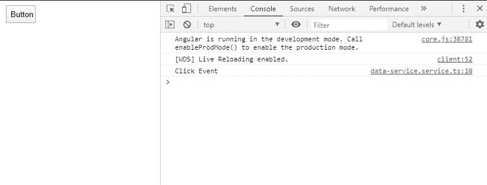
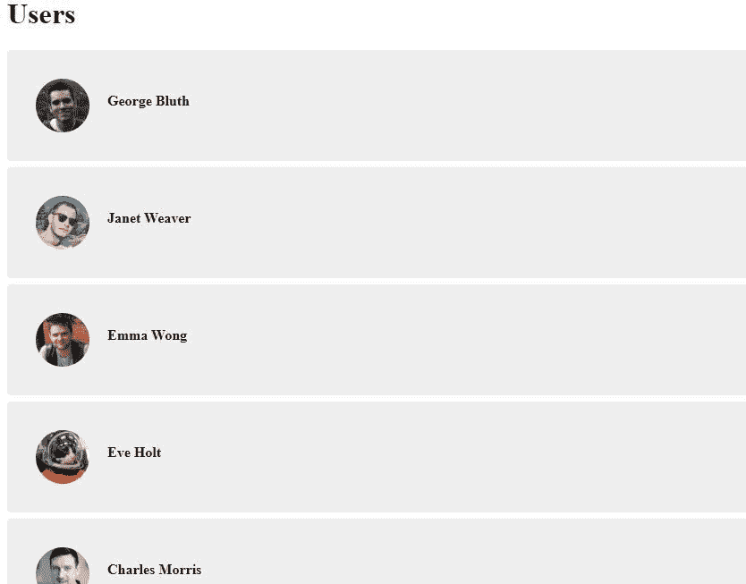

# 角度 7 |使用可观测数据的角度数据服务

> 原文:[https://www . geeksforgeeks . org/angular-7-angular-data-services-use-observatory/](https://www.geeksforgeeks.org/angular-7-angular-data-services-using-observable/)

观察到

可观察的管理异步数据和一些其他有用的模式。可观察性类似于承诺，但有一些关键的区别。与承诺不同，可观察性随着时间的推移会发出多个值。在实际场景中，web socket 或基于实时的数据或事件处理程序可以在任何给定时间发出多个值。在这种情况下，可观察性是最好的选择。

在 angular 中，Observables 是最常用的技术之一，在与数据服务的集成中被广泛用于读取 REST API。除此之外，要访问可观察对象，组件首先需要订阅可观察对象。重要的是要这样做，以访问可观察的表征状态转移(REST)中的数据，REST 是一种架构风格，它定义了一组用于创建 web 服务的约束。REST API 是一种无需任何处理就能简单灵活地访问 web 服务的方式。要阅读更多内容，您可以浏览[这个](https://www.geeksforgeeks.org/rest-api-introduction/)链接。

### 服务

服务用于创建可以共享的变量/数据，并且可以在定义它的组件之外使用。服务可以由任何组件使用，因此它充当公共数据点，数据可以从该数据点分发到应用程序中的任何组件。要阅读更多关于服务的信息，请点击[链接](https://www.geeksforgeeks.org/angularjs-services/)。

要添加服务，请在控制台中编写以下命令。

```ts
ng g s ServiceName
OR
ng generate service ServiceName

```

**示例:**
这是一个名为 Data 的服务的小示例，其中组件中发生的事件将触发服务的方法。

**数据服务代码**

## java 描述语言

```ts
import { Injectable } from '@angular/core';

@Injectable({
  providedIn: 'root'
})
export class DataServiceService {

  constructor() { }
clickEvent(){
  console.log('Click Event');
}
}
```

**应用组件代码**

## java 描述语言

```ts
import { Component } from '@angular/core';
import {DataServiceService} from './data-service.service'
@Component({
  selector: 'app-root',
  template: '<html>
                       <body>
<button (click)="clickEvent()" style="width:50px;height:30px">Button</button>
                       </body>
               </html>',
  styleUrls: ['./app.component.css']
})
export class AppComponent {
  constructor(private Data: DataService) {
  }
function cEvent(){
  this.Data.clickEvent()
}
}
```

**输出:**



**具有可观察性的服务:**
结合起来，与 REST API 一起工作是很出名的。在下面的示例中，将有一个服务，在该服务中，将使用 Angular 中的 HttpClientModule 中提供的 GET 请求功能来访问一个 API，该功能又返回一个可观察到的。这个可观察到的内容将被应用程序的一个组件订阅，然后显示在页面上。

**示例:**T2**数据服务**

## java 描述语言

```ts
import { Injectable } from '@angular/core';
//Importing HttpClientModule for GET request to API
import { HttpClient } from '@angular/common/http';
@Injectable({
  providedIn: 'root'
})
export class DataService {

  // making an instance for Get Request
  constructor(private http_instance: HttpClient ) { }
  // function returning the observable
  getInfo(){
    return this.http_instance.get('https://reqres.in/api/users')
  }
}
```

**注册用户组件**

## java 描述语言

```ts
import { Component, OnInit } from '@angular/core';
// Importing Data Service to subscribe to getInfo() observable
import { DataServiceService } from '../data-service.service'
@Component({
  selector: 'app-reg-user',
  templateUrl: './reg-user.component.html',
  styleUrls: ['./reg-user.component.css']
})
export class RegUserComponent implements OnInit {

  // instantiation of local object and the Data Service
  inst : Object;
  constructor(private data: DataServiceService ) { }

  //Subscription of the Data Service and putting all the
  // data into the local instance of component
  ngOnInit() {
    this.data.getInfo().subscribe((data)=>{
      this.inst=data;
    })
  }

}
```

**规则组件的 Html 中使用的指令**

## java 描述语言

```ts
<style>
ul {
    list-style-type: none;
    margin: 0;padding: 0;
}

    ul li {
        background: rgb(238, 238, 238);
        padding: 2em;
        border-radius: 4px;
        margin-bottom: 7px;
        display: grid;
        grid-template-columns: 60px auto;
    }

       ul li p {
            font-weight: bold;
            margin-left: 20px;
        }

       ul li img {
            border-radius: 50%;
            width: 100%;
        }

</style>
<h1>Users</h1>

<ul *ngIf="inst">
  <li *ngFor="let user of inst.data">
    

<p>{{ user.first_name }} {{ user.last_name }}</p>

  </li>
</ul>
```

**输出:**



访问应用编程接口

要运行此应用程序，请在项目内部迁移并运行以下命令。

```ts
cd < Project Path >
ng serve -o

```