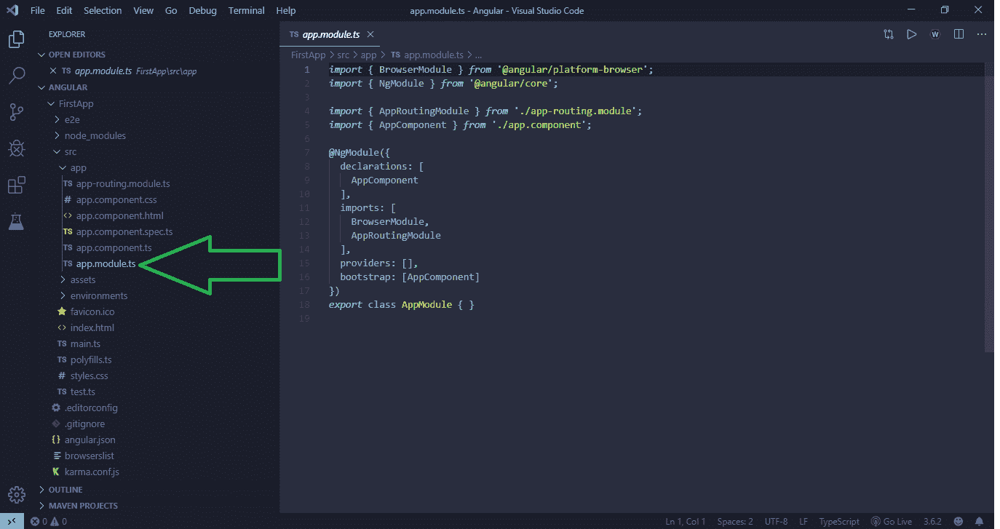
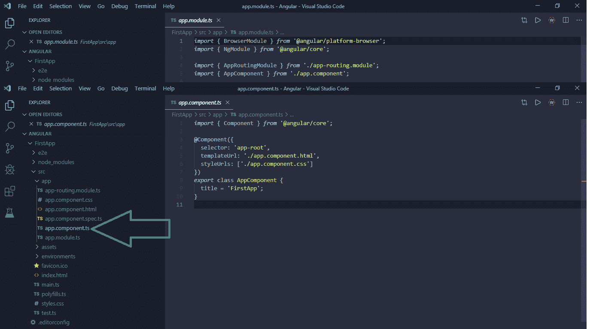
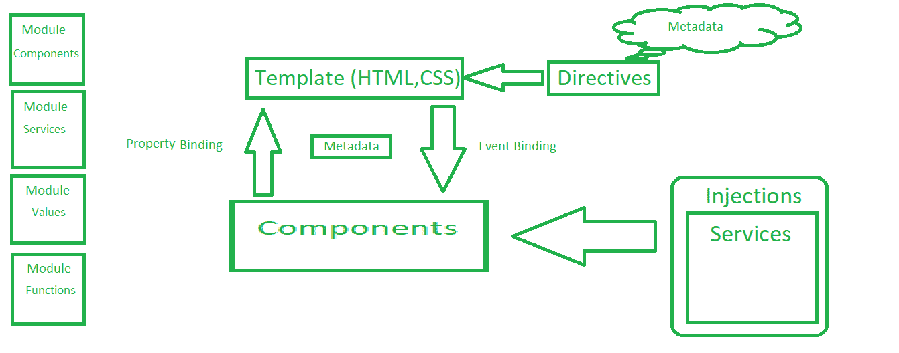
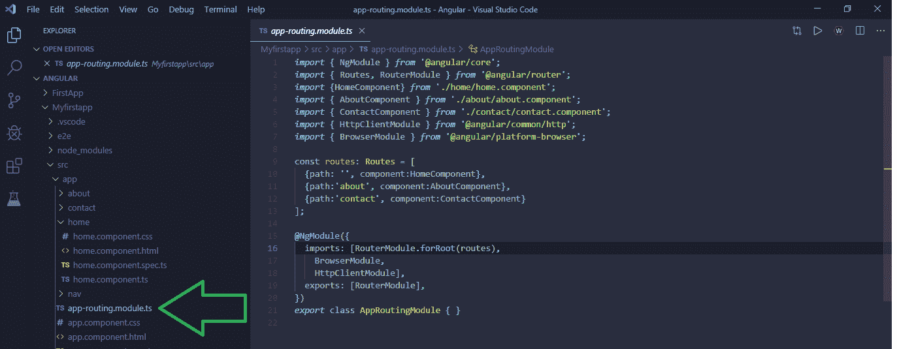

# 棱角分明 7 |建筑

> 原文:[https://www.geeksforgeeks.org/angular-7-architecture/](https://www.geeksforgeeks.org/angular-7-architecture/)

Angular 是一个用 HTML 和 TypeScript 构建基于客户端的应用程序的平台或框架。它是用 TypeScript 编写的。它将核心和可选功能实现为一组导入应用程序的 TypeScript 库。Angular 由三个主要部分组成，即模块、组件和路由。

模块是角度应用的基本构件。角度应用程序由一组模块定义。每个应用程序中都有一个根模块是很重要的。组件定义视图，视图是屏幕元素的集合，Angular 可以根据程序逻辑和数据进行选择和修改。每个应用程序中至少有一个称为根组件的组件是很重要的。组件使用服务相互通信和共享数据。路由包括多个组件之间的链接，以便导航到不同的组件。

### 模块:

NgModule 为一组组件声明编译上下文，这些组件专用于一个应用程序域、一个工作流或一组密切相关的功能。一个模块可以将其组件与相关代码(如服务)相关联，以形成功能单元。每个角度应用程序总是有一个被称为根模块的模块，在应用程序中被命名为 Appmodule。

我们可以从其他模块导入功能，并允许它们使用路由(RouterModule)导出并被其他模块使用。通过制作几个模块，我们可以划分功能并允许代码的可重用性。此外，制作模块减少了加载模块的负荷，因为它们只是按需加载的，这一特性使 Angular 本质上是健壮的。

### 组件:

每个 angular app 至少有一个被称为根组件的组件，它将组件层次结构与页面文档对象模型(DOM)连接起来。每个组件定义一个类，该类包含 TypeScript 格式的登录和 HTML 模板中的页面视图。

我们有三个组成部分。

1.  **模板:**
    HTML 模板具有页面的外观。指令提供的模板逻辑以及应用程序数据与页面 DOM 的链接是通过使用绑定来完成的。数据绑定有两种类型，一种是事件绑定(基于事件的更改)，另一种是属性绑定(基于应用程序中的数据的更改)。

2.  **服务和依赖注入:**
    通过依赖注入，我们意味着通过订阅来允许对服务的访问。它充当服务的代理。

3.  **数据绑定:**
    角度绑定有两种类型:
    *   **Event Binding:** 
        Event binding is used to capture events on the user’s end on the app and respond to it in the target environment by updating the application data. For example, changing the color of the button whenever the user clicks on it. The event binded the onclick event. 
    *   **属性绑定:**
        属性绑定用于从组件类传递数据，并便于将应用程序计算的值插值回 HTML。例如，制作一个切换颜色的按钮，该按钮在第二次点击时将其颜色变回正常。在这种情况下，模板将从应用程序数据中获取数据，并查看切换是 1 还是 0(可以是真或假)，这种类型的绑定是属性绑定。

### 组件类的元数据:

元数据意味着关于数据的数据。它包括所提供数据的内部信息。在组件的情况下，组件类的元数据包括两个基本的东西:–

1.  组件类的元数据有一个定义视图的模板。模板将普通的 HTML 与 Angular 指令和绑定相结合，允许 Angular 在屏幕上显示之前修改 HTML。

2.  服务类的元数据由信息组成，Angular 需要通过依赖注入(DI)使其对组件可用。

为了更好地理解，您可以参考下面给出的图表:

### 路由:

角度路由器模块提供了一项服务，允许您定义不同应用程序状态之间的导航路径，并查看应用程序中的层次结构。

路由器将类似网址的路径映射到其他组件，而不是页面。当用户执行某项操作(如单击链接)时，路由器会拦截浏览器的行为，并显示或隐藏组件的层次结构。它允许按需加载特性，因此成为一个健壮的应用程序。

就像网页一样，路由器也将活动记录到浏览器中，因此前进和后退按钮在路由的情况下也能工作。

### 工艺路线的工作:

路由器将类似网址的路径映射到视图，而不是页面。无论何时执行任何操作，例如单击浏览器中另一个页面的链接，路由器都会拦截浏览器的行为，并显示或隐藏视图层次结构。

如果路由器发现当前的应用程序状态需要特定的功能，并且定义它的模块还没有被加载，那么路由器可以按需延迟加载该模块，这使得应用程序本质上是健壮的。

路由器根据应用程序的导航规则和数据状态解释链接网址。路由器将活动记录在浏览器的历史记录中，因此后退和前进按钮也可以工作。

为了定义导航规则，导航路径被链接到组件。路径使用类似 URL 的语法来集成程序数据。