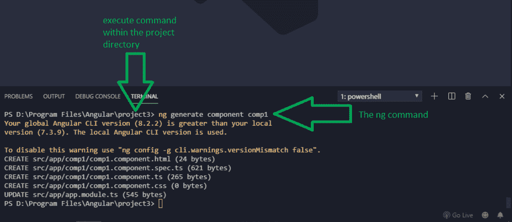
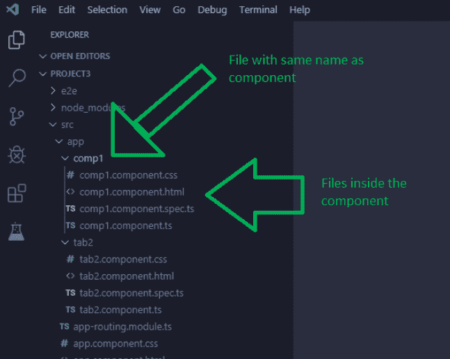

# 角度 7 |组件

> 原文:[https://www.geeksforgeeks.org/angular-7-components/](https://www.geeksforgeeks.org/angular-7-components/)

angular 中的组件类似于网站中的页面。组件是角度的关键特征。与页面相比，它们得到了很好的优化，因为它们本质上是轻量级和可重用的。

### 以角度 7 创建组件:

要在任何 angular 应用程序中创建组件，第一步是进入 app 目录，然后通过 shell 上的 ng 命令创建一个新组件。

**语法为:**

**命令写为:**

```
cd app
ng generate component comp1

```

或

```
cd app
ng g c comp1

```

执行命令后，应用程序文件夹中的新文件夹将以组件的名称形成。





### 新组件的结构

每一个新组件在创建时都包含如下所列的 4 个文件(将 comp1 视为组件的名称):

1.  **comp 1/comp 1 . component . html:**这个文件由组件外观的 HTML 代码组成。
2.  **comp 1/comp 1 . component . spec . ts:**文件是用于测试目的的类型脚本。该文件的存在不是必需的。
3.  **comp 1/comp 1 . component . ts:**该文件由 typescript 格式的组件类组成，组件名为 Comp1Component，实现 OnInit 接口，默认情况下有一个 ngOnInit()方法。当页面生命周期状态为 Init 时，在此方法中编写的代码将被执行。
4.  **comp 1/comp 1 . component . css:**这个文件有链接到上面显示的 HTML 文件的 CSS。