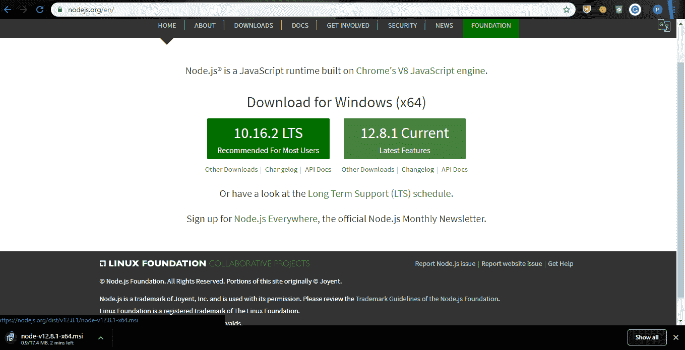
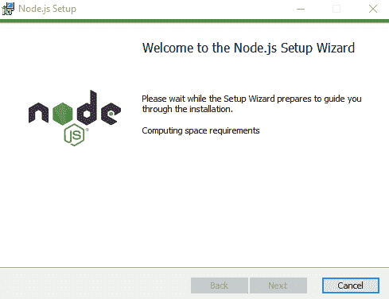
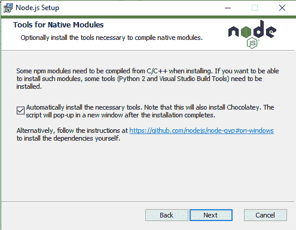
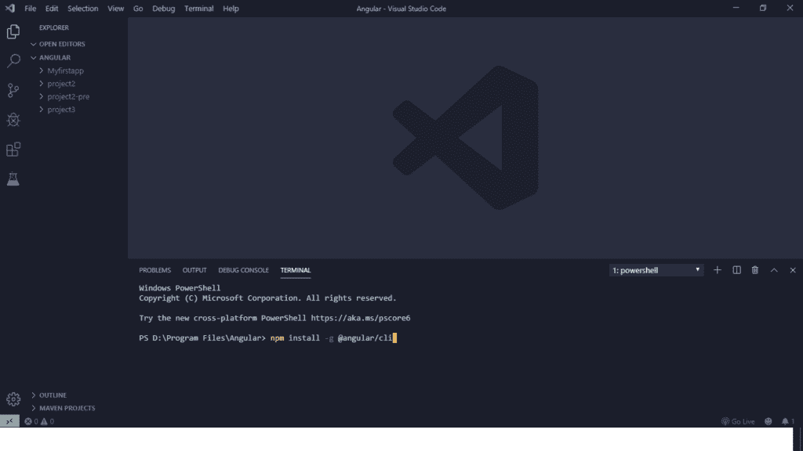
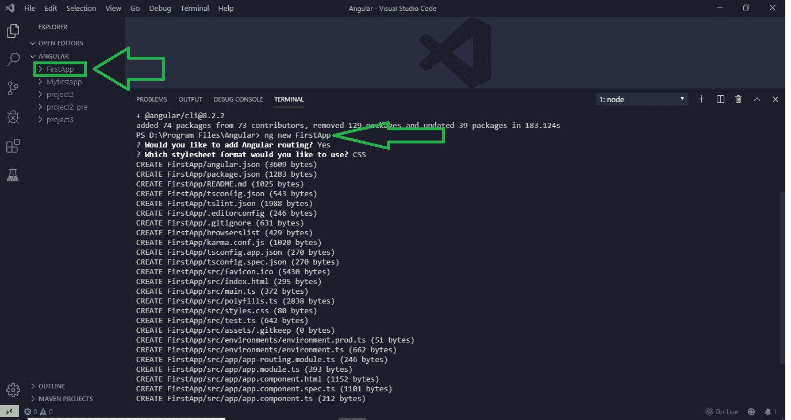

# 角度 7 |安装

> 原文:[https://www.geeksforgeeks.org/angular-7-installation/](https://www.geeksforgeeks.org/angular-7-installation/)

要在您的机器上安装 Angular 7，您必须要求在您的机器上安装以下设备。

*   安装 Visual Studio 代码集成开发环境或喷气大脑网络风暴。
*   安装 Node.js
*   使用 npm 安装 angular cli

**按照步骤设置 Angular 7 环境:**

**第一步:安装 Visual Studio Code IDE(或 jetbarks WebStorm)**
Visual Studio Code 很轻，很容易设置，它有很大范围的内置 IntelliSense 功能。它是免费使用的。它还提供了大量的扩展，将显著提高性能。

**点击链接下载**

*   VS 代码[点击此处](https://code.visualstudio.com/)下载
*   jetbrain websform[点击此处](https://www.jetbrains.com/webstorm/download/#section=windows)

**第二步:安装 node . js**
node . js 管理 npm 依赖项在加载特定页面时支持某些浏览器。它提供了运行 Angular 项目所需的库。它还服务于本地主机(本地机器)上的运行时环境。
下载 Node.js [点击这里](https://nodejs.org/en/)，按照下面截图。


 

**第三步:使用 npm 安装 angular cli**
打开你的 **VS Code IDE** 为项目路径选择一个文件夹，选择 *File- > Open Folder* 在 VS Code 上打开。
运行以下命令安装 angular CLI:

```
npm install -g @angular/cli
```



它将加载 angular cli，我们将从这里使用 ng 命令来执行进一步的操作。

**要创建 Angular 应用程序，请遵循 Angular cli 安装后的步骤:**

**第一步:制作并运行第一个应用**
现在在 CLI 的帮助下，我们准备开始构建新的默认项目。为此，在终端上编写以下命令。

```
ng new <project-name>
```

新的第一个应用



这将创建所有的设置和文件以及默认的角度页面。请注意图表，对于每个项目，它会询问是否启用路由以及我们想要选择的样式(CSS、SCSS、手写笔)。如果应用程序包含多个链接组件，请选择“是”进行传送。当一切完成后，我们会看到一个名为 FirstApp 的目录将出现在左目录列。

**步骤 2:** 现在在本地服务器上运行它。为此，首先使用 cd 命令导航到项目文件夹，然后在终端上写入以下命令。

```
cd FirstApp
```

*   -o 标志用于自动打开浏览器:
*   代表开放。

```
ng serve -o
```