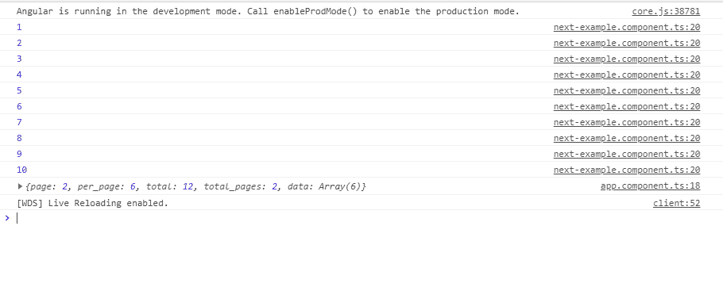
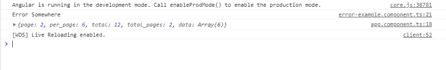
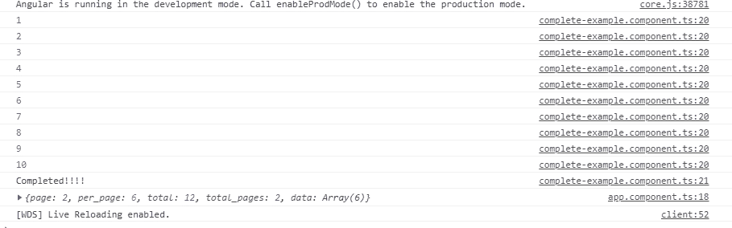
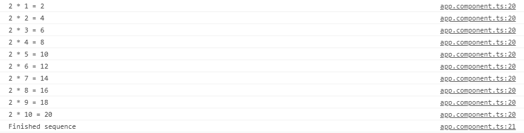
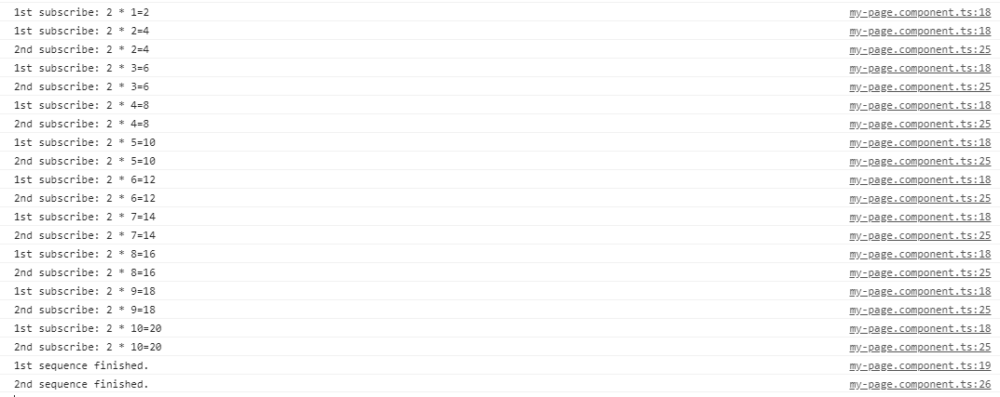

# 角度 7 |可观测

> 原文:[https://www.geeksforgeeks.org/angular-7-observables/](https://www.geeksforgeeks.org/angular-7-observables/)

Observables 在 angular 应用程序中为发布者和订阅者之间的数据共享提供支持。与 promises 之类的技术相比，它被认为是一种更好的事件处理、异步编程和处理多个值的技术。
Observables 的一个特殊功能是，它只能由订阅它的消费者访问，即定义了一个用于发布值的函数，但它不是由订阅的消费者执行的(它可以是任何组件)，只有通过它，客户才能收到通知，直到该函数运行或他们订阅。
一个可观测值可以传递任何类型的多个值。用于接收值的应用编程接口在任何情况下都是相同的，并且设置和逻辑都由可观察到的处理。Rest 的事情只是订阅和取消订阅所需的信息。
**观察者:**为了处理接收可观察的消息，我们需要一个可观察的接口，该接口由关于可观察消息的回调方法组成。一些基本方法如下:

*   **下一步:**它是每个可观察消息的处理程序，在执行开始后可以被调用零次或更多次。
    **例:**这是观察者 next()方法用法的一个简单例子。

## java 描述语言

```ts
import { Component, OnInit } from '@angular/core';
import {Observable} from 'rxjs';

@Component({
    selector: 'app-next-example',
    templateUrl: './next-example.component.html',
    styleUrls: ['./next-example.component.css']
})

export class NextExampleComponent implements OnInit {

    constructor() { }

    ngOnInit() {

        // Create a new Observable
        const sqnc = new Observable(countOnetoTen);

        // Execute the Observable and print the
        // result of each notification
        // next() is a call to countOnetoTen method
        // to get the next value from the observable
        sqnc.subscribe({
            next(num) { console.log(num); }
        });

        // This function runs when subscribe()
        // is called
        function countOnetoTen(observer) {

            for(var i = 1; i <= 10; i++) {

                // Calls the next observable
                // notification
                observer.next(i);
            }

            // Unsubscribe after completing
            // the sequence
            return {unsubscribe(){}};
        }
    }
}
```

*   **输出:**



*   **错误:**它是每个错误消息的处理程序。错误会停止可观察实例的执行。
    **示例:**这是一个示例，在代码中有意诱导错误，以了解错误是如何工作的。

## java 描述语言

```ts
import { Component, OnInit } from '@angular/core';
import { Observable } from 'rxjs';

@Component({
    selector: 'app-error-example',
    templateUrl: './error-example.component.html',
    styleUrls: ['./error-example.component.css']
})

export class ErrorExampleComponent implements OnInit {

    constructor() { }

    ngOnInit() {

        // Create a new Observable
        const sqnc = new Observable(generateError);

        // Execute the Observable and print the
        // result of each notification
        // error() is called when next generate
        // some error
        sqnc.subscribe({
            next(num) { },
            error(err) { console.log('Error Somewhere')}
        });

        // This function runs when subscribe() is called
        function generateError(observer){

            // Calls the next observable notification
            // It generates an error and error is called
            observer.next( adddlert("Welcome guest!"));

            // Unsubscribe after completing the sequence
            return {unsubscribe(){}};
        }
    }

}
```

*   **输出:**



*   **完成:**是一个通知可观察执行完成的句柄。
    **示例:**这个示例展示了完整功能的使用。完成通知由观察者在可观察的执行完成后触发。

## java 描述语言

```ts
import { Component, OnInit } from '@angular/core';
import { Observable } from 'rxjs';

@Component({
    selector: 'app-complete-example',
    templateUrl: './complete-example.component.html',
    styleUrls: ['./complete-example.component.css']
})

export class CompleteExampleComponent implements OnInit {

    constructor() { }

    ngOnInit() {

        // Create a new Observable
        const sqnc = new Observable(countOnetoTen);

        // Execute the Observable and print the
        // result of each notification
        sqnc.subscribe({
            next(num) { console.log(num); },
            complete(){console.log("Completed!!!!")}
        });

        // This function runs when subscribe()
        // is called
        function countOnetoTen(observer){

            for(var i = 1; i <= 10; i++) {

                // Calls the next observable
                // notification
                observer.next(i);
            }

            observer.complete();

            // Unsubscribe after completing
            // the sequence
            return {unsubscribe(){}};
        }
    }
}
```

*   **输出:**



**做一个可观测值:**在下面的例子中，我们将做一个简单的可观测值，得到一个 2 的表。这段代码写在 app.component.ts 文件中。在使用 Observables 之前，请通过编写以下代码从 rjs 库中导入 Observables。

```ts
import {Observables} from 'rxjs'

```

## java 描述语言

```ts
import { Component } from '@angular/core';
import {Observable} from "rxjs";
import { CompileTemplateMetadata } from '@angular/compiler';

@Component({
    selector: 'app-rt',
    templateUrl: './app.component.html',
    styleUrls: ['./app.component.css']
})

export class AppComponent {
    title = 'MyFirstApp';
}

// Create a new Observable that will
// deliver the above sequence
const table = new Observable(tableOfTwo);

// Execute the Observable and print the
// result of each notification
// next() is a call to tableOfTwo() method
// to get the next value from the observable
table.subscribe({
    next(num) { console.log(num); },
    complete() { console.log('Finished sequence'); }
});

// This function runs when subscribe() is called
function tableOfTwo(observer) {

    for(var i = 1; i <= 10; i++) {
      observer.next('2 * ' + i + ' = ' + i*2);
    }

    observer.complete();
    return {unsubscribe(){}};
}
```

在该代码中， **next()** 用于从可观测值调用下一个返回，在可观测值中，任务完成后，它返回取消订阅功能，导致取消订阅可观测值，因此不能再进行请求。当调用 complete()方法时，它会打印字符串“Finished sequence”。所有功能都显示在控制台中。
**输出:**



**多播:**这是一种在单次执行中向多个订户的列表广播可观察到的内容的实践。通过可观察到的多播，在文档上没有要注册的多个侦听器，而是重用第一个侦听器，并将值发送给每个订阅者。这是通过确定关于值是否要被多路广播的可观察值来完成的。
继续上面的例子，现在将执行多播操作，这将在两个 2 序列上强制转换相同的 2 表，并且在执行另一个操作之前将等待一秒钟。

## java 描述语言

```ts
import { Component, OnInit } from '@angular/core';
import {Observable} from 'rxjs';

@Component({
    selector: 'app-my-page',
    templateUrl: './my-page.component.html',
    styleUrls: ['./my-page.component.css']
})

export class MyPageComponent implements OnInit {

    constructor() { }

    ngOnInit() {

        const multiSeq = new Observable(this.multiSeqSubs());

        multiSeq.subscribe({
            next(num) { console.log('1st subscribe: ' + num); },
            complete() { console.log('1st sequence finished.'); }
        });

        // Subscribe again After 1 seconds.
        setTimeout(() => {
            multiSeq.subscribe({
                next(num) { console.log('2nd subscribe: ' + num); },
                complete() { console.log('2nd sequence finished.'); }
            });
        }, 1000);
    }

    multiSeqSubs() {
        const seq = [];

        for (var i = 1; i <= 10; i++) {

            // Pushes the string onto sequence
            seq.push('2 * ' + i + '=' + 2*i)
        }  

        // Keep track of each observer
        const obs = [];

        // A single time Stamp for one
        // set of values being generated,
        // multicasted to each subscriber
        let timeStamp;

        // Return the subscriber function
        // (runs when subscribe() function
        // is invoked)
        return (ob) => {
            obs.push(ob);

            // When this is the first subscription,
            // start the sequence
            if (obs.length === 1) {
                timeStamp = this.exec_Sequence({
                    next(val) {

                        // Iterate through observers
                        // and notify all subscriptions
                        obs.forEach(o => o.next(val));
                    },

                    complete() {

                        // Notify all complete callbacks
                        obs.slice(0).forEach(o => o.complete());
                    }
                }, seq, 0);
            }

            return {

                // Unsubscribe from the observers
                unsubscribe() {

                    obs.splice(obs.indexOf(ob), 1);

                    // Cleanup
                    if (obs.length === 0) {
                        clearTimeout(timeStamp);
                    }
                }
            };
        };
    }

    // Executes the sequence
    exec_Sequence(observer, sequence, index) {
        return setTimeout(() => {
            observer.next(sequence[index]);
            if (index === sequence.length - 1) {
                observer.complete();
            } else {
                this.exec_Sequence(observer, sequence, ++index);
            }
        }, 1000);
    }

    // Create a new Observable that will
    // deliver the above sequence
}
```

这段代码执行相同的功能，即处理多播操作。在这段代码中，我们有一个观察器列表，它取决于为多播操作所做的订阅数量。这里，在代码执行期间，我们只有两个正在执行的操作，因此我们在“obs”列表中只有两个元素。
**输出:**



**错误处理:**
Observables 产生异步值，因此 try/catch 不会捕获任何错误，因为它可能会导致停止代码，而不考虑在该时间实例上运行的其他任务。相反，我们通过在观察者上指定一个错误回调来处理错误。当产生错误时，它会导致可观察到的清理订阅并停止为该订阅产生值。一个可观察的可以产生值(调用下一个回调)，或者它可以完成，调用完成或错误回调。

**错误回调的语法**

```ts
observable.subscribe({
    next(val) { console.log('Next: ' + val)},
    error(err) { console.log('Error: ' + err)}
});

```