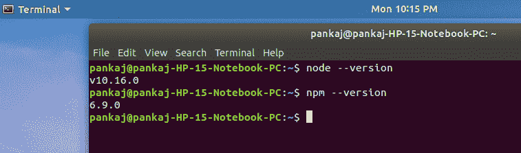
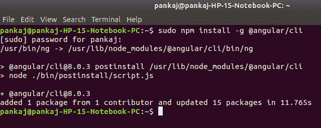
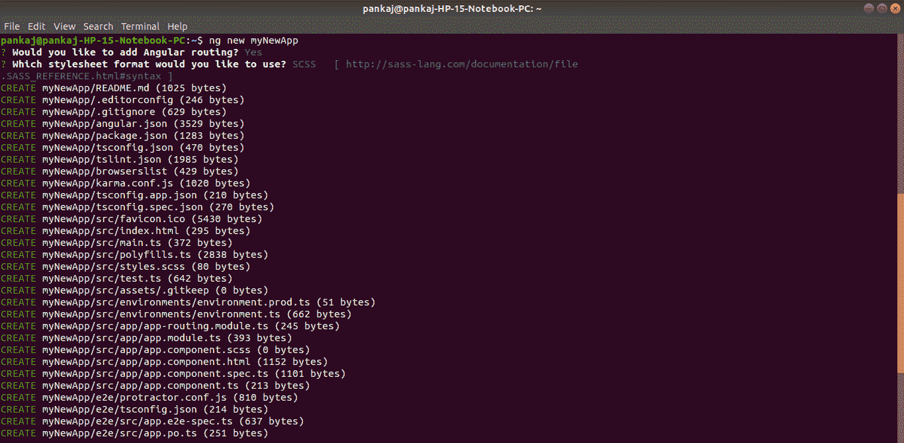
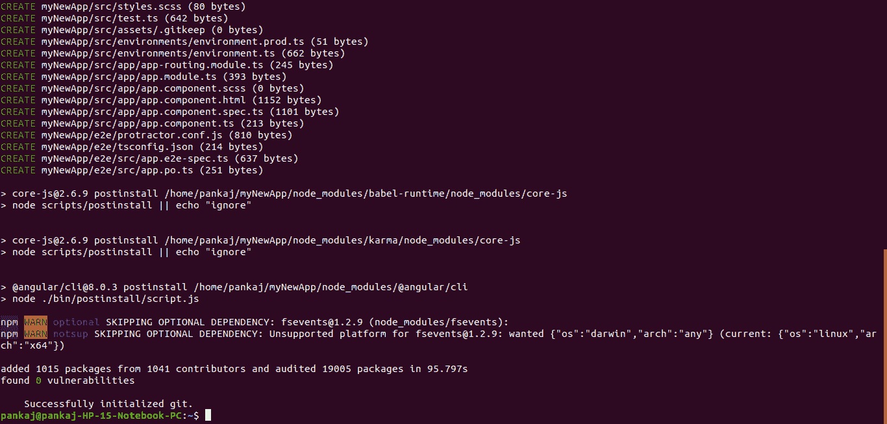
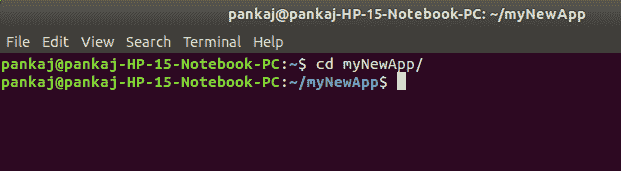
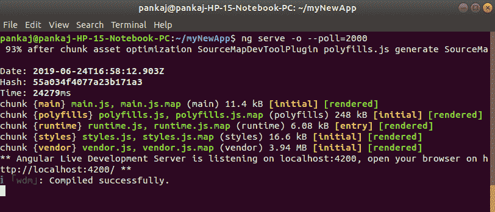
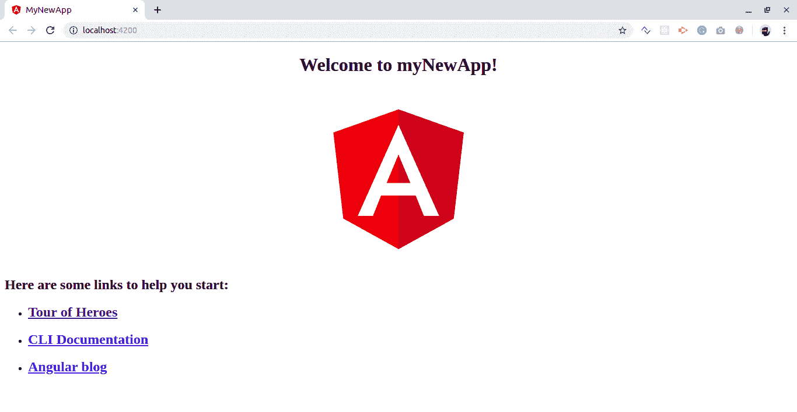
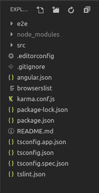
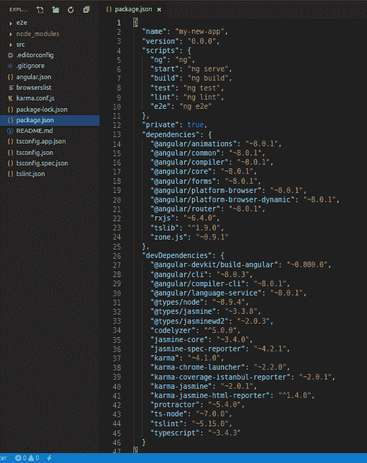

# 角度 CLI |角度项目设置

> 原文:[https://www . geesforgeks . org/angular-CLI-angular-project-setup/](https://www.geeksforgeeks.org/angular-cli-angular-project-setup/)

**Angular** 是一个用于创建 web 应用的前端框架。默认情况下，它使用 typescript 为类创建逻辑和方法，但是浏览器不知道 typescript。这里 webpack 进来的图片，webpack 是用来把这些 typescript 文件编译成 JavaScript 的。此外，在您的计算机上运行一个角度项目需要如此多的配置文件。
**Angular CLI** 是一个工具，可以通过一些简单的命令为你完成所有这些事情。Angular CLI 使用后面的 webpack 来完成所有这些过程。

**注意:**请确保您的系统中已经安装了节点和 npm。您可以使用以下命令检查您的节点版本和 npm 版本:

```ts
node --version
npm --version

```



**使用 angular CLI 创建第一个应用程序的步骤:**

*   **Step-1: Install angular cli**

    ```ts
    npm install - g @angular/cli
    ```

    

*   **步骤 2:通过此命令**
    创建新项目选择是作为路由选项，选择 CSS 或 SCSS。

```ts
ng new myNewApp
```




*   **Step-3: Go to your project directory**

    ```ts
    cd myNewApp
    ```

    

    *   **Step-4: Run server and see your application in action**

    ```ts
    ng serve -o --poll=2000
    ```

    
    

**目录结构介绍:**


*   **e2e** 包含与自动化测试目的相关的代码。例如，如果在某个页面上你正在调用一个 REST API，那么返回状态代码应该是什么，它是否可接受等等。
*   **node_modules** 它保存所有的开发依赖项(仅在开发时使用)和依赖项(用于开发以及在生产时需要)，任何新的依赖项在添加到项目时都会自动保存到该文件夹中。
*   **src** 这个目录包含了我们所有与项目相关的工作，即创建组件、创建服务、将 CSS 添加到各自的页面等。
*   **package.json** 该文件存储安装了指定版本的项目中添加和使用的库的信息。每当一个新的库被添加到项目中，它的名称和版本就会被添加到 package.json.
    中的依赖项中

**其他文件:**作为初学者，此时不需要这些文件，不必为此费心。这些都用于编辑器配置和编译时所需的信息。angular CLI 中内置的网络包为您管理所有内容。

**src 文件夹内:**

*   **index.html**这是应用程序的入口点， **app-root** 标签是应用程序在这个单页应用程序上的入口点，在这个页面上 angular 会在 DOM 中添加或删除内容或将新内容添加到 DOM 中。基座**对于布线很重要。

    ```ts
    <!DOCTYPE HTML>
    <html lang="en">
        <head>
            <meta charset="utf-8">
            <title>MyNewApp</title>
            <base href="/">

            <meta name="viewport" content="width=device-width, initial-scale=1">
            <link rel="icon" typw="image/x-icon" href="favison.ico">
        </head>
        <body>
            <app-root></app-root>
        </body>
    </html>
    ```** 
*   **style . SCS**这个文件是你可以添加到很多组件通用的 css 类或者选择器的全局样式表，比如你可以导入自定义字体，导入 bootstrap.css 等。
*   **资产**它包含了 js 图像、字体、图标和许多其他项目文件。

**app 文件夹内:**

*   **app.module.ts** 一个有角度的项目是由许多其他模块组成的，为了创建一个应用程序，您必须在层次结构中为您的应用程序创建一个根模块。这个 app.module.ts 文件就是那个。如果您想在根级别添加更多模块，您可以添加。
    *   **声明**它是数组存储其组件的引用。应用程序组件是创建项目时生成的默认组件。您必须将所有组件的引用添加到该数组中，以使它们在项目中可用。
    *   **导入**如果你想添加任何模块，无论是角度的还是你必须将其添加到导入数组中，以使它们在整个项目中可用。
    *   **提供者**如果您将为您的应用程序创建任何服务，那么您将通过这个提供者数组将其注入到您的项目中。注入到模块中的服务对它及其在项目层次结构中的子模块是可用的。
    *   **引导**这里引用了创建的默认组件，即 AppComponent
*   **app.component.html**编辑此文件以更改页面。您可以将此文件编辑为 HTML 文件。直接使用 div 或身体标签中使用的任何其他标签，这些是组件，不添加 **html 头部身体**标签。

    ```ts
    <h1>
        Hello world
    </h1>

    <div>
        <p>
            This is my First Angular app.
        </p>
    </div>
    ```

*   这些是自动生成的文件，包含源组件的单元测试。
*   **app.component.ts** 你可以在。ts 文件。处理将包括连接到数据库、与其他组件交互、路由、服务等活动。
*   **app . component . SCS**这里可以给你的组件添加 css。你可以写 SCS，然后由 transpiler 进一步编译成 css。

**在进行项目时需要的更多命令:**

```ts
ng generate component component_name
ng generate service service_name
ng generate directive directive_name

```