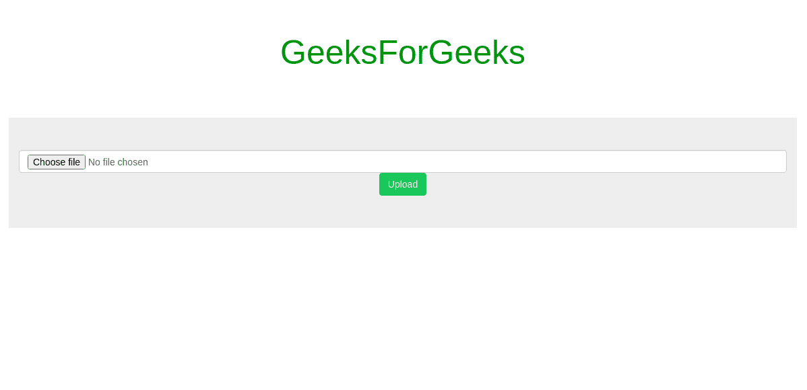
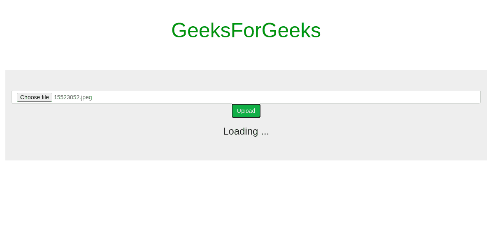
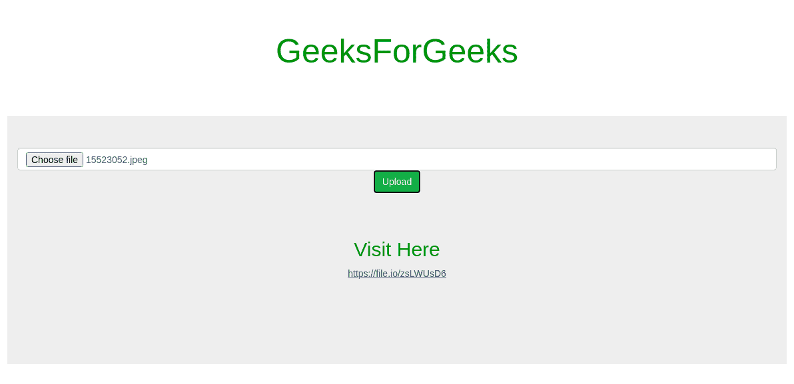

# 角度文件上传

> 原文:[https://www.geeksforgeeks.org/angular-file-upload/](https://www.geeksforgeeks.org/angular-file-upload/)

文件上传是制作存储某种图像数据的表单的基本组件。它有助于应用程序使用图像上传或文件共享。这个文件上传组件使用 *file.io* API 来上传文件，作为回报，它提供了一个可共享的链接。此外，我们可以发送获取请求到共享链接来获取文件，但目前，我们唯一的重点是上传部分，所以我们只使用张贴方法。

**进场:**

1.  使用以下命令创建一个新的角度应用程序-

    ```html
    ng new angular-file-upload 
    ```

2.  使用 cd 命令在应用内移动-

    ```html
    cd src/app/
    ```

3.  生成新组件文件-上传-

    ```html
    ng g c file-upload/ 
    ```

4.  打开 src/app 文件夹，开始编辑**app.component.html**文件。

    ```html
    <app-file-upload></app-file-upload>
    ```

5.  通过命令-

    ```html
    ng g s file-upload/
    ```

    为文件上传组件创建服务
6.  打开 src/app/file-upload 文件夹，开始编辑**文件-upload.component.ts** 文件。

    ```html
    import { Component, OnInit } from '@angular/core';
    import { FileUploadService } from './file-upload.service';

    @Component({
        selector: 'app-file-upload',
        templateUrl: './file-upload.component.html',
        styleUrls: ['./file-upload.component.css']
    })
    export class FileUploadComponent implements OnInit {

        // Variable to store shortLink from api response
        shortLink: string = "";
        loading: boolean = false; // Flag variable
        file: File = null; // Variable to store file

        // Inject service 
        constructor(private fileUploadService: FileUploadService) { }

        ngOnInit(): void {
        }

        // On file Select
        onChange(event) {
            this.file = event.target.files[0];
        }

        // OnClick of button Upload
        onUpload() {
            this.loading = !this.loading;
            console.log(this.file);
            this.fileUploadService.upload(this.file).subscribe(
                (event: any) => {
                    if (typeof (event) === 'object') {

                        // Short link via api response
                        this.shortLink = event.link;

                        this.loading = false; // Flag variable 
                    }
                }
            );
        }
    }
    ```

7.  打开 src/app/file-upload/并开始编辑**文件-upload.service.ts** 文件。

    ```html
    import { Injectable } from '@angular/core';
    import {HttpClient} from '@angular/common/http';
    import {Observable} from 'rxjs';
    @Injectable({
      providedIn: 'root'
    })
    export class FileUploadService {

      // API url
      baseApiUrl = "https://file.io"

      constructor(private http:HttpClient) { }

      // Returns an observable
      upload(file):Observable<any> {

          // Create form data
          const formData = new FormData(); 

          // Store form name as "file" with file data
          formData.append("file", file, file.name);

          // Make http post request over api
          // with formData as req
          return this.http.post(this.baseApiUrl, formData)
      }
    }
    ```

8.  打开 src/app/file-上传并开始编辑**file-upload.component.html**文件。

    ```html
    <div class="text-center">
        <input class="form-control" type="file" 
                (change)="onChange($event)">

        <button (click)="onUpload()" 
            class="btn btn-success">
            Upload
        </button>
    </div>

    <!-- Shareable short link of  uoloaded file -->
    <div class="container text-center jumbotron"
        *ngIf="shortLink">
        <h2> Visit Here</h2>
        <a href="{{shortLink}}">{{shortLink}}</a>
    </div>

    <!--Flag variable is used here-->
    <div class="container" *ngIf="loading">
        <h3>Loading ...</h3>
    </div>
    ```

9.  打开 src/app/并开始编辑 **app.module.ts** 文件。

    ```html
    import { BrowserModule } from 
        '@angular/platform-browser';
    import { NgModule } from '@angular/core';

    import { FileUploadComponent } from 
        './file-upload/file-upload.component';

    import { AppComponent } from './app.component';
    import {HttpClientModule} from 
        '@angular/common/http';
    @NgModule({
      declarations: [
        AppComponent,
        FileUploadComponent,
      ],
      imports: [
        BrowserModule,
        HttpClientModule
      ],
      providers: [],
      bootstrap: [AppComponent]
    })
    export class AppModule { }
    ```

10.  Now run this command to serve on localhost

    ```html
    ng serve
    ```

    **输出:**

    *   **文件选择前:**
        
    *   **文件选择后点击按钮:**
        
    *   **装载完成后:**
        

    HTML 是网页的基础，通过构建网站和网络应用程序用于网页开发。您可以通过以下 [HTML 教程](https://www.geeksforgeeks.org/html-tutorials/)和 [HTML 示例](https://www.geeksforgeeks.org/html-examples/)从头开始学习 HTML。