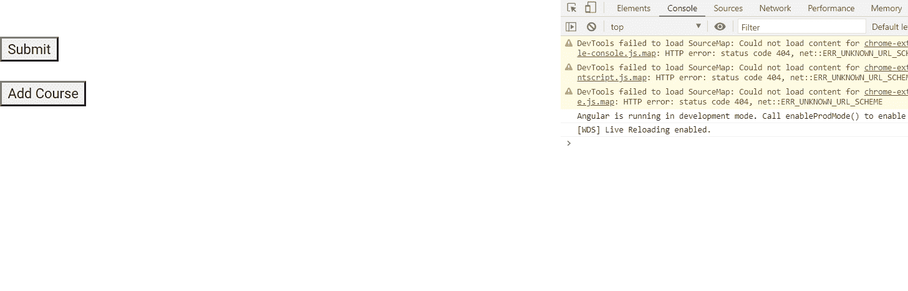

# 角形形式动力学指令

> 原文:[https://www . geesforgeks . org/angular-forms-formarrayname-direction/](https://www.geeksforgeeks.org/angular-forms-formarrayname-directive/)

在本文中，我们将看到什么是 Angular 10 中的 Style 以及如何使用它。

**表单名称**用于将嵌套的表单与 DOM 元素同步。

**语法:**

```ts
<div formArrayName="arrayName">
```

**模块:**FormArrayName 使用的模块为:

*   **反应式模具模块**

**选择器:**

*   **【形式化名称】**

**进场:**

*   创建要使用的角度应用程序
*   在 app.component.ts 中，创建一个从表单中获取值的数组
*   在 app.component.html，制作一个表单，将数组中的值发送给提交者。
*   使用 ng serve 为 angular app 服务，以查看输出。

**例 1:**

## app.component.ts

```ts
import { Component, Inject } from '@angular/core';
import { FormGroup, FormControl, FormArray } from '@angular/forms'
@Component({
    selector: 'app-root',
    templateUrl: './app.component.html',
    styleUrls: ['./app.component.css']
})
export class AppComponent {
    form = new FormGroup({
        courses: new FormArray([]),
    });

    get courses(): FormArray {
        return this.form.get('courses') as FormArray;
    }

    addCourse() {
        this.courses.push(new FormControl());
    }

    onSubmit() {
        console.log(this.courses.value);
    }

}
```

## app.component.html

```ts
<br>
<form [formGroup]="form" (ngSubmit)="onSubmit()">
    <div formArrayName="courses">

        <div *ngFor="let course of courses.controls; index as i">
            <input [formControlName]="i" placeholder="Course">
        </div>
    </div>
    <br>
    <button>Submit</button>
    <br><br>
</form>

<button (click)="addCourse()">Add Course</button>
```

**输出:**



**参考:**T2**https://angular.io/api/forms/FormArrayName**T5】