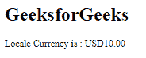
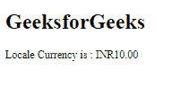

# 角形格式货币指令

> 原文:[https://www . geesforgeks . org/angular-forms-format currency-direction/](https://www.geeksforgeeks.org/angular-forms-formatcurrency-directive/)

在本文中，我们将看到什么是 Angular 10 中的 formatCurrency 以及如何使用它。**格式化货币**用于使用区域设置规则将数字格式化为货币。

**语法:**

```ts
formatCurrency(value, locale, currency, currencyCode, digitsInfo)
```

**参数:**

*   **值:** 要格式化的数字。
*   **地区:** 地区格式的地区代码。
*   **货币:** 包含货币符号或其名称的字符串。
*   **货币代码:**货币代码。
*   **数字信息:** 十进制表示选项。

**返回值:**

*   **字符串:**格式化的货币代码。

**模块:**格式货币使用的模块为:

*   **公共模块**

**进场:**

*   创建要使用的角度应用程序。
*   在 app.module.ts 中导入 LOCALE_ID，因为我们需要为使用 get formatCurrency 导入 LOCALE。

    ```ts
    import { LOCALE_ID, NgModule } from '@angular/core';
    ```

*   在 app.component.ts 导入格式货币和 LOCALE_ID
*   将 LOCALE_ID 作为公共变量注入。
*   在 app.component.html，使用字符串插值显示局部变量
*   使用 ng serve 为 angular app 服务，以查看输出。

**例 1:**

## app.component.ts

```ts
import {
  formatCurrency
 }
  from '@angular/common';

import {Component,
  Inject,
  LOCALE_ID }
  from '@angular/core';

@Component({
selector: 'app-root',
templateUrl: './app.component.html'
})
export class AppComponent {
curr = formatCurrency(10,this.locale,
          'USD');
constructor(
  @Inject(LOCALE_ID) public locale: string,){}
}
```

## app.component.html

```ts
<h1>
  GeeksforGeeks
</h1>

<p>Locale Currency is : {{curr}}</p>
```

**输出:**



**例 2:**

## app.component.ts

```ts
import {
  formatCurrency
 }
  from '@angular/common';

import {Component,
  Inject,
  LOCALE_ID }
  from '@angular/core';

@Component({
selector: 'app-root',
templateUrl: './app.component.html'
})
export class AppComponent {
curr = formatCurrency(10,this.locale,
          'INR');
constructor(
  @Inject(LOCALE_ID) public locale: string,){}
}
```

## app.component.html

```ts
<h1>
  GeeksforGeeks
</h1>

<p>Locale Currency is : {{curr}}</p>
```

**输出:**



**参考:**T2】https://angular.io/api/common/formatCurrency