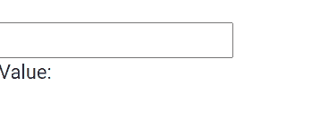

# 角度形式控制指令

> 原文:[https://www . geesforgeks . org/angular-forms-formcontroldirective/](https://www.geeksforgeeks.org/angular-forms-formcontroldirective/)

在本文中，我们将看到什么是 Angular 10 中的 FormControlDirective，以及如何使用它。

**表单控制指令**用于将独立的表单控制实例与表单控制元素同步

```
<form [FormControlDirective] ="name">
```

**出口自:**

*   **反应式模具模块**

**选择器:**

*   【T0【表格控制】

**进场:**

*   创建要使用的角度应用程序
*   在 app.component.ts 中，创建一个包含输入值的对象。
*   在 app.component.html，使用 FormControlDirective 获取值。
*   使用 ng serve 为 angular app 服务，以查看输出。

**示例:**

## app.component.ts

```
import { Component, Inject } from '@angular/core';
  import { FormGroup, FormControl, FormArray } from '@angular/forms'
  @Component({
    selector: 'app-root',
    templateUrl: './app.component.html',
    styleUrls: [ './app.component.css' ]
  })
  export class AppComponent  {
    geek: FormControl = new FormControl('');
  }
```

## app.component.html

```
<br>
<input [formControl]="geek">

<p>Value: {{ geek.value }}</p>
```

**输出:**



**参考:**T2】https://angular.io/api/forms/FormControlDirective