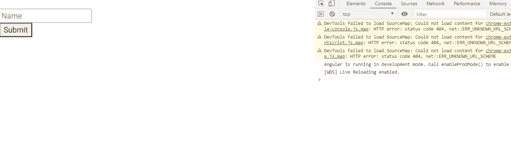

# 角度形式组指令

> 原文:[https://www . geesforgeks . org/angular-forms-formgroup directive/](https://www.geeksforgeeks.org/angular-forms-formgroupdirective/)

在本文中，我们将看到什么是 Angular 10 中的 FormGroupDirective，以及如何使用它。

**表单组指令**用于将现有表单组绑定到 DOM 元素。

**语法:**

```
<form [FormGroup] ="name">
```

**出口自:**

*   **反应式模具模块**

**选择器:**

*   **【模具组】**

**进场:**

*   创建要使用的角度应用程序
*   在 app.component.ts 中，创建一个包含输入值的对象。
*   在 app.component.html，使用表单组获取值。
*   使用 ng serve 为 angular app 服务，以查看输出。

**例 1:**

## app.component.ts

```
import { Component, Inject } from '@angular/core';
  import { FormGroup, FormControl, FormArray } from '@angular/forms'
  @Component({
    selector: 'app-root',
    templateUrl: './app.component.html',
    styleUrls: [ './app.component.css' ]
  })
  export class AppComponent  {
    form = new FormGroup({
      name: new FormControl()
    });

    get name(): any {
      return this.form.get('name');
    }

    onSubmit(): void {
      console.log(this.form.value); 
    }

  }
```

## app.component.html

```
<br>
<form [formGroup]="form" (ngSubmit)="onSubmit()">
  <input formControlName="name" placeholder="Name">
  <br>
  <button type='submit'>Submit</button>
  <br>
  <br>
</form>
```

**输出:**



**参考:**T2】https://angular.io/api/forms/FormGroupDirective