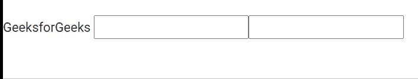

# 角形最大长度验证器指令

> 原文:[https://www . geesforgeks . org/angular-forms-maxlength validator-direction/](https://www.geeksforgeeks.org/angular-forms-maxlengthvalidator-directive/)

在本文中，我们将看到什么是 Angular 10 中的 MaxLengthValidator，以及如何使用它。
**最大长度验证器**用于将独立的表单控件实例与表单控件元素同步

```ts
<input maxLength ="number">
```

**出口自:**

*   **反应式模具模块**
*   模具模块

**选择器:**

*   **[最大长度] [格式控制名称]**
*   【T0【最大长度】【形状控制】
*   **[最大长度] [ng 模型]**

**进场:**

*   创建要使用的角度应用程序
*   在 app.component.html，将 maxLength 设置为 input，这样当您将数据放入该输入元素时，您就不会不断超过最大值。
*   使用 ng serve 为 angular app 服务，以查看输出。

**示例:**

## app.component.html

```ts
<span>GeeksforGeeks</span>
<input type="text" maxlength="12">
<input maxlength="5">
```

**输出:**



**参考:**T2】https://angular.io/api/forms/MaxLengthValidator