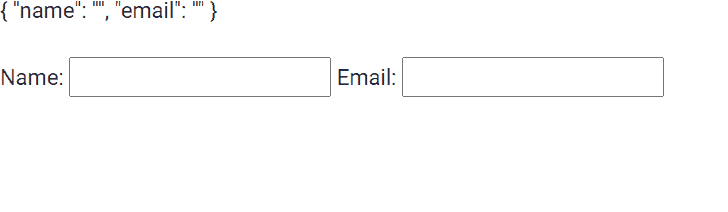

# 角形指令

> 原文:[https://www . geeksforgeeks . org/angular-forms-ngform-direction/](https://www.geeksforgeeks.org/angular-forms-ngform-directive/)

在本文中，我们将了解 Angular 10 中的 NgForm 是什么，以及如何使用它。 **NgForm** 用于创建顶级表单组 Instance，它将表单绑定到给定的表单值。

**语法:**

```ts
<form #FormName = "ngForm"> </form>
```

**模块:**NgForm 使用的模块是:

*   模具模块

**选择器:**

*   **【ngform】**

**进场:**

*   创建要使用的角度应用程序
*   在 app.module.ts 导入表单模块中。
*   在 app.component.html，制作一个表单，将其值存储在 ngForm 变量中，并在 JSON 表单中显示其值。
*   使用 ng serve 为 angular app 服务，以查看输出。

**例 1:**

## app.module.ts

```ts
import { NgModule } from '@angular/core';
import { FormsModule } from '@angular/forms';
import { BrowserModule } from '@angular/platform-browser';
import { BrowserAnimationsModule } from '@angular/platform-browser/animations';

import { AppComponent }   from './app.component';

@NgModule({
  bootstrap: [
    AppComponent
  ],
  declarations: [
    AppComponent
  ],
  imports: [
    FormsModule,
    BrowserModule,
    BrowserAnimationsModule,

  ]
})
export class AppModule { }
```

## app.component.html

```ts
<form #gfgform = "ngForm">
  {{ gfgform.value | json }}
  <br>
  <br>
  Name: <input type="text" name = 'name' ngModel>
  Email: <input type="email" name = 'email' ngModel>
</form>
```

**输出:**



**参考:**T2**https://angular.io/api/forms/NgForm**T5】