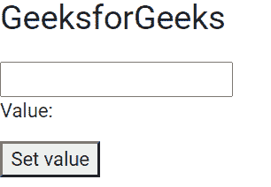

# 角形模型指令

> 原文:[https://www . geesforgeks . org/angular-forms-ng model-direction/](https://www.geeksforgeeks.org/angular-forms-ngmodel-directive/)

在这篇文章中，我们将看到什么是 Angular 10 中的 NgModel，以及如何使用它。**n model**用于创建顶级表单组 Instance，它将表单绑定到给定的表单值。

**语法:**

```ts
<Input [(NgModel)= 'name']>
```

**模块:**模块使用的模块是:

*   模具模块

**选择器:**

*   **[ng 模型]**

**进场:**

*   创建要使用的角度应用程序
*   在 app.component.ts 中，创建一个给输入字段赋值的变量。
*   在 app.component.html，制作一个表格并使用 ngModel 获取输入的值。
*   使用 ng serve 为 angular app 服务，以查看输出。

**例 1:**

## app.component.ts

```ts
import { Component, Inject } from '@angular/core';
  import { PLATFORM_ID } from '@angular/core';
  import { isPlatformWorkerApp } from '@angular/common';

  @Component({
    selector: 'app-root',
    templateUrl: './app.component.html',
    styleUrls: [ './app.component.css' ]
  })
  export class AppComponent  {
    gfg: string = '';

  setValue() {
    this.gfg = 'GeeksforGeeks';
  }
  }
```

## app.component.html

```ts
<h1>GeeksforGeeks</h1>

<input [(ngModel)]="gfg" #ctrl="ngModel" required>

<p>Value: {{ gfg }}</p>

<button (click)="setValue()">Set value</button>
```

**输出:**



**参考:**T2】https://angular.io/api/forms/NgModel