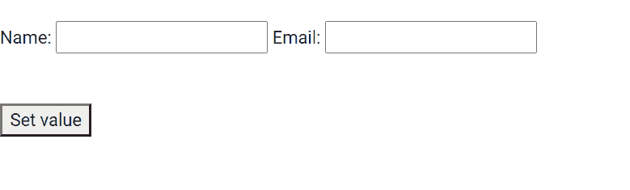

# 模型组指令中的角形

> 原文:[https://www . geesforgeks . org/angular-forms-ng model group-direction/](https://www.geeksforgeeks.org/angular-forms-ngmodelgroup-directive/)

在这篇文章中，我们将看到什么是 Angular 10 中的 NgModelGroup，以及如何使用它。 **NgModelGroup** 用于创建顶级表单组实例，它将表单绑定到给定的表单值。

**语法:**

```
<div ngModelGroup="name"></div>
```

**模块:**模块由模块组使用:

*   模具模块

**选择器:**

*   **【ngmodelgroup】**

**进场:**

*   创建一个要使用的角度应用程序
*   在 app.component.ts 中，创建一个包含输入值的对象。
*   在 app.component.html，使用模型组获取值。
*   使用 ng serve 为 angular app 服务，以查看输出。

**示例:**

## app.component.ts

```
import { Component, Inject } from '@angular/core';

  @Component({
    selector: 'app-root',
    templateUrl: './app.component.html',
    styleUrls: [ './app.component.css' ]
  })
  export class AppComponent  {
    gfg:any;

  setValue() {
    this.gfg = {first: 'Geeky', email: 'abc@gfg.com'};
  }
}
```

## app.component.html

```
<br>
<form #f="ngForm">
  <div ngModelGroup="gfg" #nameCtrl="ngModelGroup">
    Name: <input name="first" [ngModel]="gfg.first" >
    Email: <input name="email" [ngModel]="gfg.email" >
  </div> 
</form>
<br><br>

<button (click)="setValue()">Set value</button>
```

**输出:**



**参考:**T2**https://angular.io/api/forms/NgModelGroup**T5】