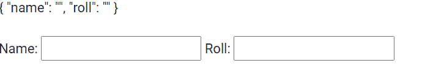

# 角形模块指令

> 原文:[https://www . geesforgeks . org/angular-forms module-direction/](https://www.geeksforgeeks.org/angular-formsmodule-directive/)

在本文中，我们将看到什么是 Angular 10 中的 FormsModule 以及如何使用它。

**表单模块**用于为表单实现进行所有必要的导入。

**语法:**

```ts
import { FormsModule } from '@angular/forms';
```

**进场:**

*   创建一个要使用的角度应用程序。
*   在 app.component.ts 中，从 FormsModules 导入表单。
*   在 app.component.html，使用 FormsModule 制作表单。
*   使用 ng serve 为 angular app 服务，以查看输出。

**例 1:**

## app.component.ts

```ts
import { NgModule } from '@angular/core';

// Importing forms module
import { FormsModule } from '@angular/forms';
import { BrowserModule } from '@angular/platform-browser';
import { BrowserAnimationsModule } from 
    '@angular/platform-browser/animations';

import { AppComponent }   from './app.component';

@NgModule({
  bootstrap: [
    AppComponent
  ],
  declarations: [
    AppComponent
  ],
  imports: [
    FormsModule,
    BrowserModule,
    BrowserAnimationsModule,
  ]
})
export class AppModule { }
```

## app.component.html

```ts
<form #gfgform = "ngForm">
  {{ gfgform.value | json }}
  <br>
  <br>
  Name: <input type="text" name = 'name' ngModel>
  Roll: <input type="text" name = 'roll' ngModel>
</form>
```

**输出:**



**参考:**T2】https://angular.io/api/forms/FormsModule