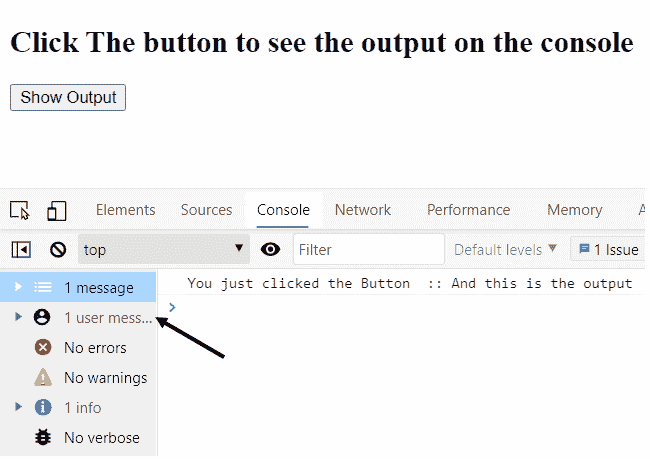
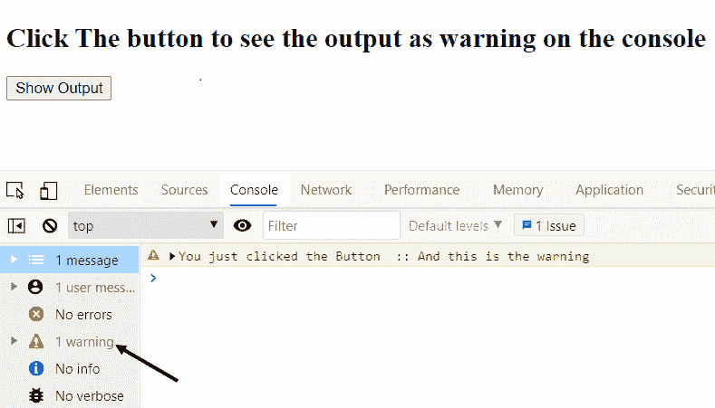
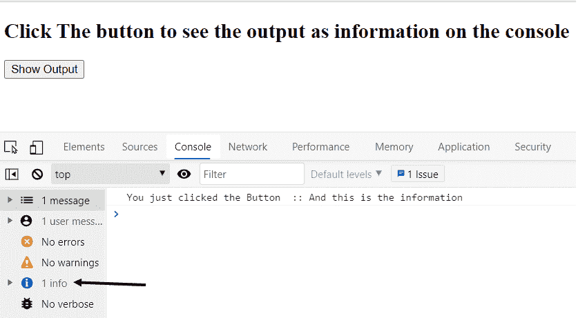
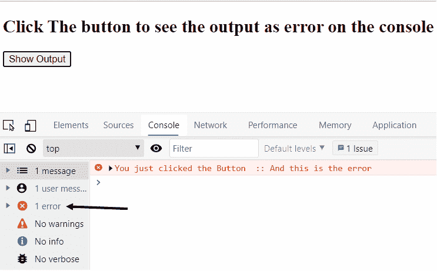
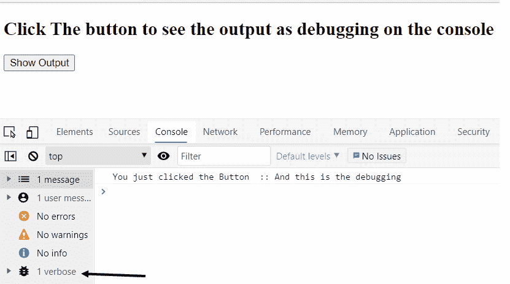

# Angular.js $log Service

> 原文:[https://www.geeksforgeeks.org/angular-js-log-service/](https://www.geeksforgeeks.org/angular-js-log-service/)

Angular.js 中的$log 服务只是用于浏览器控制台上的日志记录目的。它用于代码中错误的调试和故障排除。它有各种实现，如日志、警告、信息、错误和调试，以及所有建议的名称。它分别用于记录、警告、信息、错误显示和调试消息目的。

现在让我们看看 Angular JS 中 **$log** 服务的实际实现。
**使用方法:**
**1。log()方法:**此方法用于在控制台上写入日志消息。

## 超文本标记语言

```
<!DOCTYPE html>
<html>

<head>
    <title>$log service in Angular JS</title>
    <script src=
"https://ajax.googleapis.com/ajax/libs/angularjs/1.6.9/angular.min.js">
    </script>
</head>

<!-- Creating an Angular app  -->

<body ng-app="LogService">

    <!-- Now Making a heading -->
    <h2>
        Click The button to see
        the output on the console
    </h2>

    <!-- Making a div with a ng-controller -->
    <div ng-controller="LogServiceController">

        <!-- Making a button to display the output -->
        <button ng-click="showOutput()">
            Show Output
        </button>
    </div>

    <!-- Angular JS code -->
    <script>

        // Defining the app for Angular JS
        var app = angular.module('LogService', []);

        // Defining the controller
        app.controller('LogServiceController',
            ['$scope', '$log', function ($scope, $log) {

                // Defining the error message to be
                // shown on console
                $scope.message = "You just clicked the Button";

                // Defining the onclick function
                $scope.showOutput = function () {

                    //$log service
                    $log.log($scope.message +
                        "  :: And this is the output");
                }
            }]);
    </script>
</body>

</html>
```

#### 输出:



**2。warn()方法:**该方法用于在控制台屏幕上显示警告信息。

## 超文本标记语言

```
<!DOCTYPE html>
<html>

<head>
    <title>$log service in Angular JS</title>
    <script src=
"https://ajax.googleapis.com/ajax/libs/angularjs/1.6.9/angular.min.js">
    </script>
</head>

<!-- Creating an Angular app -->
<body ng-app="LogService">

    <!-- Now Making a heading -->
    <h2>
        Click The button to see the output
        as warning on the console
    </h2>

    <!-- Making a div with a ng-controller -->
    <div ng-controller="LogServiceController">

        <!-- Making a button to display the output -->
        <button ng-click="showOutput()">
            Show Output
        </button>
    </div>

    <!-- Angular JS code -->
    <script>

        // Defining the app for Angular JS
        var app = angular.module('LogService', []);

        // Defining the controller
        app.controller('LogServiceController',
            ['$scope', '$log', function ($scope, $log) {

                // Defining the error message to be
                // shown on console
                $scope.message = "You just clicked the Button";

                // Defining the onclick function
                $scope.showOutput = function () {

                    //$log service
                    $log.warn($scope.message
                        + "  :: And this is the warning");
                }
            }]);
    </script>
</body>

</html>
```

### 输出:



**3。info()方法:**此方法用于在控制台屏幕上显示信息消息。

## 超文本标记语言

```
<!DOCTYPE html>
<html>

<head>
    <title>$log service in Angular JS</title>
    <script src=
"https://ajax.googleapis.com/ajax/libs/angularjs/1.6.9/angular.min.js">
    </script>
</head>

<!-- Creating an Angular app  -->
<body ng-app="LogService">

    <!-- Now Making a heading -->
    <h2>
        Click The button to see the output
        as information on the console
    </h2>

    <!-- Making a div with a ng-controller -->
    <div ng-controller="LogServiceController">

        <!-- Making a button to display 
            the output -->
        <button ng-click="showOutput()">
            Show Output
        </button>
    </div>

    <!-- Angular JS code -->
    <script>

        // Defining the app for Angular JS
        var app = angular.module('LogService', []);

        // Defining the controller
        app.controller('LogServiceController',
            ['$scope', '$log', function ($scope, $log) {

                // Defining the error message to be
                // shown on console
                $scope.message = "You just clicked the Button";

                // Defining the onclick function
                $scope.showOutput = function () {

                    //$log service
                    $log.info($scope.message
                        + "  :: And this is the information");
                }
            }]);
    </script>
</body>

</html>
```

### 输出:



**4。error()方法:**此方法用于在控制台屏幕上写入错误消息。

## 超文本标记语言

```
<!DOCTYPE html>
<html>

<head>
    <title>$log service in Angular JS</title>
    <script src=
"https://ajax.googleapis.com/ajax/libs/angularjs/1.6.9/angular.min.js">
    </script>
</head>

<!-- First of all creating and Angular JS app  -->
<body ng-app="LogService">

    <!-- Now Making a heading -->
    <h2>
        Click The button to see the
        output as error on the console
    </h2>

    <!-- Making a div with a ng-controller -->
    <div ng-controller="LogServiceController">

        <!-- Making a button to display the output -->
        <button ng-click="showOutput()">
            Show Output
        </button>
    </div>

    <!-- Angular JS code -->
    <script>

        // Defining the app for Angular JS
        var app = angular.module('LogService', []);

        // Defining the controller
        app.controller('LogServiceController',
            ['$scope', '$log', function ($scope, $log) {

                // Defining the error message to be
                // shown on console
                $scope.message = "You just clicked the Button";

                // Defining the onclick function
                $scope.showOutput = function () {

                    //$log service
                    $log.error($scope.message
                        + "  :: And this is the error");
                }
            }]);
    </script>
</body>

</html>
```

### 输出:



**5。debug()方法:**此方法用于在控制台屏幕上写入调试消息。

## 超文本标记语言

```
<!DOCTYPE html>
<html>

<head>
    <title>$log service in Angular JS</title>
    <script src=
"https://ajax.googleapis.com/ajax/libs/angularjs/1.6.9/angular.min.js">
    </script>
</head>

<!-- Creating an Angular app  -->
<body ng-app="LogService">

    <!-- Now Making a heading -->
    <h2>
        Click The button to see the output 
        as debugging on the console
    </h2>

    <!-- Making a div with a ng-controller -->
    <div ng-controller="LogServiceController">

        <!-- Making a button to display the output -->
        <button ng-click="showOutput()">
            Show Output
        </button>
    </div>

    <!-- Angular JS code -->
    <script>

        // Defining the app for Angular JS
        var app = angular.module('LogService', []);

        // Defining the controller
        app.controller('LogServiceController',
            ['$scope', '$log', function ($scope, $log) {

                // Defining the error message to be
                // shown on console
                $scope.message = "You just clicked the Button";

                // Defining the onclick function
                $scope.showOutput = function () {

                    //$log service

                    $log.debug($scope.message
                        + "  :: And this is the debugging");
                }
            }]);
    </script>
</body>

</html>
```

### 输出:

