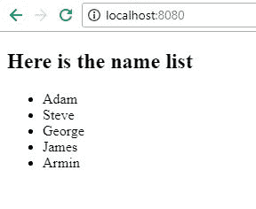

# 角度-角度-重复指令

> 原文:[https://www . geesforgeks . org/angular-js-ng-repeat-direction/](https://www.geeksforgeeks.org/angular-js-ng-repeat-directive/)

Angular-JS ng-repeat 指令是一个方便的工具，可以多次重复一组 HTML 代码，或者在一组项目中的每个项目重复一次。ng-repeat 主要用于数组和对象。
ng-repeat 类似于我们在 C、C++或其他语言中使用的循环，但在技术上，它为我们正在访问的集合中的每个元素实例化一个模板(通常是一组 HTML 结构)。Angular 维护一个$index 变量作为当前正在访问的元素的键，用户也可以访问这个变量。

**语法:**

```ts
<div ng-repeat="keyName in MyObjectName ">
  {{keyName}}
</div>

```

这里的“MyObjectName”是一个集合，它可以是一个对象或数组，您可以使用“keyName”访问其中的每个值。

**例 1**

1.  Create an app.js file for the app.

    ```ts
    var app = angular.module('myApp',[]);

    app.controller('MainCtrl', function($scope){
        $scope.names = ['Adam','Steve','George','James','Armin'];
        console.log($scope.names);
    });
    ```

    **第 1 行-** 创建了一个名为“myApp”的应用模块，没有依赖关系。
    **3 号线-** 主控制器供我们应用。
    **第 4 行-** 字符串“名称”数组。

2.  Create index.html page

    ```ts
    <!DOCTYPE html>
    <html ng-app="myApp">
    <head>
         <title>Angular ng-repeat</title>
         <script> type="text/javascript" src="jquery-3.2.1.min.js">
                                                          </script>
         <script> type="text/javascript" src="angular.js"></script>
         <script> type="text/javascript" src="app.js"></script>
    </head>
    <body ng-controller="MainCtrl">
         <h2>Here is the name list</h2>
         <ul>
            <li ng-repeat="name in names">
                {{name}}
            </li>
         </ul>
    </body>
    </html> 
    ```

    **第 5 行-** 包含所有依赖项，如 jquery、angular-js 和 app.js 文件
    **第 12 行-** 使用 ng-repeat 指令一次从 names 数组中获取一个名称并显示。

3.  **输出:**
    

**Example 2**

*   **app.js 文件**

    ```ts
    var app = angular.module('myApp',[]);

    app.controller('MainCtrl', function($scope){
        $scope.strings= ['Geeks','For','Geeks'];
        console.log($scope.strings);
    });
    ```

    *   We have a list of three strings.

    **index.html**

    ```ts
    <!DOCTYPE html>
    <html ng-app="myApp">
    <head>
         <title>Angular ng-repeat</title>
         <script> type="text/javascript" src="jquery-3.2.1.min.js">
                                                          </script>
         <script> type="text/javascript" src="angular.js"></script>
         <script> type="text/javascript" src="app.js"></script>
    </head>
    <body ng-controller="MainCtrl">
         <h2>Here is the string list</h2>
         <ul>
            <li ng-repeat="s in strings>
                {{name}}
            </li>
         </ul>
    </body>
    </html> 
    ```

    **注意-** “按$index 追踪”在这里使用，因为我们的列表中有重复的条目，即“极客”。不允许重复的键，因为 AngularJS 使用键将 DOM 节点与项目相关联。“按$index 跟踪”将导致项目由它们在数组中的位置而不是它们的值来键入

    *   **Output :**

    ****应用:****

    1.  ng-repeat 可用于迭代数组，这比通常的 javascript 方法需要更少的代码行。
    2.  过滤器可以与 ng-repeat 一起使用，创建一个易于实现的搜索栏。

    ****参考文献****

    *   [https://angular . org/](https://angularjs.org/)
    *   [https://docs.angularjs.org/api/ng/directive/ngRepeat](https://docs.angularjs.org/api/ng/directive/ngRepeat)
    *   [https://docs.angularjs.org/error/ngRepeat/dupes](https://docs.angularjs.org/error/ngRepeat/dupes)