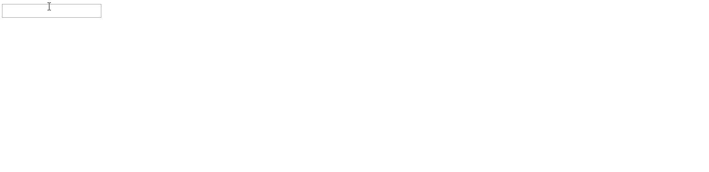
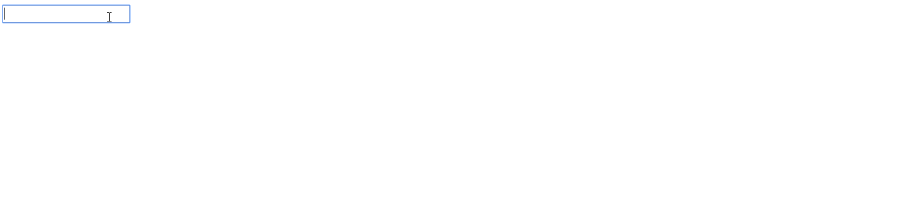
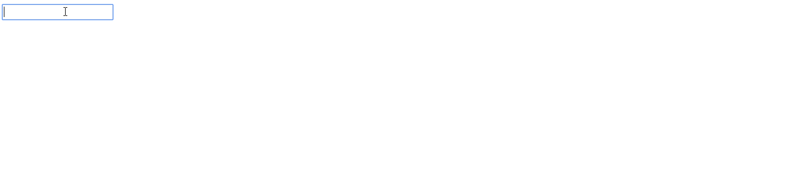

# 角度|按键事件

> 原文:[https://www.geeksforgeeks.org/angular-keyup-event/](https://www.geeksforgeeks.org/angular-keyup-event/)

**简介**

在这里，我们将解释在 Angular2 中可以与**(键盘输入)**一起使用的**(键盘输入)**事件和选项。有各种各样的选项可以用于(按键)事件，但首先让我向您解释什么是**(按键)**。

****(键位)**是一个 Angular 事件绑定，响应任何 DOM 事件。这是一个同步事件，在用户与基于文本的输入控件交互时触发。
当用户**按下并释放一个键时，发生(键盘向上)事件。**用于基于文本的输入控件时，通常用于在每次按键后获取值。**

****基本语法**(键盘输入)**

```ts
<input (keyup)="function(parameter)">
```

**Angular 在$event 变量中提供了一个对应的 DOM 事件对象，该对象也可以与(keyup)事件一起使用来传递值或事件。**

**对于传递事件**语法**将是:**

```ts
<input (keyup)="keyFunc($event)">
```

****使用方法(按键):****

**使用(keyup)我们可以调用用户定义的函数，该函数包含显示文本的逻辑。**

*   **创建一个将接受输入的**输入**元素。**
*   **在该输入元素中，通过传递**$事件调用**(键盘输入)**事件上的用户定义函数。****
*   **将 **$event** 转换为 TypeScript 文件中的用户定义函数，并通过**事件.目标.值**从事件变量中获取值，并将其添加到局部变量中，以查看击键时的同步变化。**

****示例:****

**在这个实现中， **$event** 被传递给 typescript 文件中的用户定义函数 onKeyUp()。该功能将每次击键后输入的每个值添加到定义的**文本**变量中，然后显示文本变量。
T5】component.html 文件**

```ts
<!-- event is passed to function -->
<input (keyup)="onKeyUp($event)"> 
<!-- text variable is displayed -->
<p>{{text}}</p> 
```

****组件. ts 文件:****

```ts
import { Component, OnInit } from '@angular/core';

@Component({
  selector: 'app-txtchk',
  templateUrl: './txtchk.component.html',
  styleUrls: ['./txtchk.component.css']
})
export class TxtchkComponent implements OnInit {
  text = ''; //initialised the text variable

  ngOnInit(): void {
  }
  onKeyUp(x) { // appending the updated value to the variable
    this.text += x.target.value + ' | ';
  }
  }
```

****输出:**
**

****(按键)选项:****

**有许多选项可以与(keyup)事件一起使用:**

*   ****(keyup.Space)**

    (键盘输入。Space)事件用于在按下空格键时生成事件。空间)。

    **示例实现**
    **component.html 文件**

    ```ts
    <!-- after space is pressed event is passed to function -->
    <input (keyup.Space)="onKeyUp($event)"> 
    <p>{{text}}</p> <!-- text variable is displayed -->
    ```

    **组件文件**

    ```ts
    import { Component, OnInit } from '@angular/core';

    @Component({
      selector: 'app-txtchk',
      templateUrl: './txtchk.component.html',
      styleUrls: ['./txtchk.component.css']
    })
    export class TxtchkComponent implements OnInit {
      text = ''; //initialised the text variable

      ngOnInit(): void {
      }
      onKeyUp(x) { // appending the updated value to the variable
        this.text += x.target.value + ' | ';
      }
      }
    ```

    **输出**
    

    每次空格键被触发，文本变量的值就会被更新。** 
*   ****(keyup.enter)**

    (键盘输入)事件用于在按下回车键时生成事件。让我们以上面的例子为例，将(keyup)改为(keyup.enter)。

    **示例实现**

    **component.html 文件**

    ```ts
    <!--after enter is pressed event is passed to function -->
    <input (keyup.enter)="onKeyUp($event)"> 
    <p>{{text}}</p> <!-- text variable is displayed -->
    ```

    **组件文件**

    ```ts
    import { Component, OnInit } from '@angular/core';

    @Component({
      selector: 'app-txtchk',
      templateUrl: './txtchk.component.html',
      styleUrls: ['./txtchk.component.css']
    })
    export class TxtchkComponent implements OnInit {
      text = ''; //initialised the text variable

      ngOnInit(): void {
      }
      onKeyUp(x) { // appending the updated value to the variable
        this.text += x.target.value + ' | ';
      }
      }
    ```

    **输出**
    

    每次触发输入时，文本变量的值都会更新。** 
*   ****(keyup.a(anyCustomCharacter))**

    当您按下您在键盘事件中提到的任何字符时，此事件被触发。字符可以是(a-z、A-Z、0-9 或任何其他特殊字符)。exp。(keyup.z):这里的变化将显示在 z 字符触发。
    取相同的代码，只是将(keyup)改为(keyup.z)。

    **示例实现**

    **component.html 文件**

    ```ts
    <!--after z is pressed event is passed to function -->
    <input (keyup.z)="onKeyUp($event)"> 
    <p>{{text}}</p> <!-- text variable is displayed -->
    ```

    **组件文件**

    ```ts
    import { Component, OnInit } from '@angular/core';

    @Component({
      selector: 'app-txtchk',
      templateUrl: './txtchk.component.html',
      styleUrls: ['./txtchk.component.css']
    })
    export class TxtchkComponent implements OnInit {
      text = ''; //initialised the text variable

      ngOnInit(): void {
      }
      onKeyUp(x) { // appending the updated value to the variable
        this.text += x.target.value + ' | ';
      }
      }
    ```

    **输出**
    

    每次 z 被触发，文本变量的值就会更新。** 
*   ****(keyup.esc)**

    (keyup.esc)事件用于在按下 esc 键时生成事件。让我们举上面的例子，只是将(keyup)更改为(keyup.esc)。

    **示例实现**

    **component.html 文件**

    ```ts
    <!--after esc is pressed event is passed to function -->
    <input (keyup.esc)="onKeyUp($event)"> 
    <p>{{text}}</p> <!-- text variable is displayed -->
    ```

    **组件文件**

    ```ts
    import { Component, OnInit } from '@angular/core';

    @Component({
      selector: 'app-txtchk',
      templateUrl: './txtchk.component.html',
      styleUrls: ['./txtchk.component.css']
    })
    export class TxtchkComponent implements OnInit {
      text = ''; //initialised the text variable

      ngOnInit(): void {
      }
      onKeyUp(x) { // appending the updated value to the variable
        this.text += x.target.value + ' | ';
      }
      }
    ```

    **输出**
    

    每次触发 esc 键时，文本变量的值都会更新。
    与上面类似，还有许多其他选项可以与(快捷键)一起使用** 
*   ****(keyup.shift)**

    (keyup.shift)事件用于在按下 shift 键时生成事件。

    **示例实现**

    **component.html 文件**

    ```ts
    <!--after esc is pressed event is passed to function -->
    <input (keyup.shift)="onKeyUp($event)"> 
    <p>{{text}}</p> <!-- text variable is displayed -->
    ```

    **组件文件**

    ```ts
    import { Component, OnInit } from '@angular/core';

    @Component({
      selector: 'app-txtchk',
      templateUrl: './txtchk.component.html',
      styleUrls: ['./txtchk.component.css']
    })
    export class TxtchkComponent implements OnInit {
      text = ''; //initialised the text variable

      ngOnInit(): void {
      }
      onKeyUp(x) { // appending the updated value to the variable
        this.text += x.target.value + ' | ';
      }
      }
    ```

    **输出**
    ** 
*   ****(keyup.control)**

    (keyup.control)事件用于在按下控制键时生成事件。

    **示例实现**

    **component.html 文件**

    ```ts
    <!--after esc is pressed event is passed to function -->
    <input (keyup.control)="onKeyUp($event)"> 
    <p>{{text}}</p> <!-- text variable is displayed -->
    ```

    **组件文件**

    ```ts
    import { Component, OnInit } from '@angular/core';

    @Component({
      selector: 'app-txtchk',
      templateUrl: './txtchk.component.html',
      styleUrls: ['./txtchk.component.css']
    })
    export class TxtchkComponent implements OnInit {
      text = ''; //initialised the text variable

      ngOnInit(): void {
      }
      onKeyUp(x) { // appending the updated value to the variable
        this.text += x.target.value + ' | ';
      }
      }
    ```

    **输出**
    ** 
*   ****(keyup.alt)**

    (keyup.alt)事件用于在按下 alt 键时生成事件。

    **示例实现**

    **component.html 文件**

    ```ts
    <!--after esc is pressed event is passed to function -->
    <input (keyup.alt)="onKeyUp($event)"> 
    <p>{{text}}</p> <!-- text variable is displayed -->
    ```

    **组件文件**

    ```ts
    import { Component, OnInit } from '@angular/core';

    @Component({
      selector: 'app-txtchk',
      templateUrl: './txtchk.component.html',
      styleUrls: ['./txtchk.component.css']
    })
    export class TxtchkComponent implements OnInit {
      text = ''; //initialised the text variable

      ngOnInit(): void {
      }
      onKeyUp(x) { // appending the updated value to the variable
        this.text += x.target.value + ' | ';
      }
      }
    ```

    **输出**
    ** 
*   ****(keyup.backspace)**

    (keyup.backspace)事件用于在按下 backspace 键时生成事件。其基本语法是:-

    **示例实现**

    **component.html 文件**

    ```ts
    <!--after esc is pressed event is passed to function -->
    <input (keyup.backspace)="onKeyUp($event)"> 
    <p>{{text}}</p> <!-- text variable is displayed -->
    ```

    **组件文件**

    ```ts
    import { Component, OnInit } from '@angular/core';

    @Component({
      selector: 'app-txtchk',
      templateUrl: './txtchk.component.html',
      styleUrls: ['./txtchk.component.css']
    })
    export class TxtchkComponent implements OnInit {
      text = ''; //initialised the text variable

      ngOnInit(): void {
      }
      onKeyUp(x) { // appending the updated value to the variable
        this.text += x.target.value + ' | ';
      }
      }
    ```

    **输出**
    ** 
*   ****(keyup.arrowup)**

    (keyup.arrowup)事件用于在按下 arrowup 键时生成事件。

    **示例实现**

    **component.html 文件**

    ```ts
    <!--after esc is pressed event is passed to function -->
    <input (keyup.arrowup)="onKeyUp($event)">
    <p>{{text}}</p> <!-- text variable is displayed -->
    ```

    **组件文件**

    ```ts
    import { Component, OnInit } from '@angular/core';

    @Component({
      selector: 'app-txtchk',
      templateUrl: './txtchk.component.html',
      styleUrls: ['./txtchk.component.css']
    })
    export class TxtchkComponent implements OnInit {
      text = ''; //initialised the text variable

      ngOnInit(): void {
      }
      onKeyUp(x) { // appending the updated value to the variable
        this.text += x.target.value + ' | ';
      }
      }
    ```

    **输出**
    

    因此，**(键盘输入)**可以与许多选项一起使用，它们的所有实现几乎相同，只是用法与所使用的选项不同。**