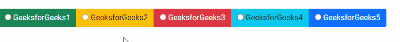

# 角度引导按钮组件

> 原文:[https://www . geesforgeks . org/angular-ng-bootstrap-buttons-component/](https://www.geeksforgeeks.org/angular-ng-bootstrap-buttons-component/)

Angular ng bootstrap 是一个 bootstrap 框架，与 Angular 一起使用来创建具有很好风格的组件，这个框架非常容易使用，用于制作响应性网站。

在这篇文章中，我们将知道如何在角度引导中使用按钮。**按钮**用于制作一组按钮。

**安装语法:**

```ts
ng add @ng-bootstrap/ng-bootstrap
```

**进场:**

*   首先，使用上述命令安装 angular ng 引导程序。
*   在模块中导入引导模块

    ```ts
    import { NgbModule } from '@ng-bootstrap/ng-bootstrap';

    imports: [
      NgbModule
    ]

    ```

*   在 app.component.html 制造按钮组件。
*   使用 ng serve 为应用提供服务。

**例 1:**

## app.component.html

```ts
<br/>
<div class="btn-group btn-group-toggle">
  <label class="btn-success" ngbButtonLabel>
    <input type="checkbox" ngbButton> 
    GeeksforGeeks1
  </label>
  <label class="btn-warning" ngbButtonLabel>
    <input type="checkbox" ngbButton>
    GeeksforGeeks2
  </label>
  <label class="btn-danger" ngbButtonLabel>
    <input type="checkbox" ngbButton> 
    GeeksforGeeks3
  </label>
  <label class="btn-info" ngbButtonLabel>
    <input type="checkbox" ngbButton>
    GeeksforGeeks4
  </label>
  <label class="btn-primary" ngbButtonLabel>
    <input type="checkbox" ngbButton> 
    GeeksforGeeks5
  </label>
```

## app.module.ts

```ts
import { NgModule } from '@angular/core';

// Importing forms module
import { FormsModule, ReactiveFormsModule  } 
from '@angular/forms';
import { BrowserModule } 
from '@angular/platform-browser';
import { BrowserAnimationsModule }
from '@angular/platform-browser/animations';

import { AppComponent }   from './app.component';
import { NgbModule } 
from '@ng-bootstrap/ng-bootstrap';

@NgModule({
  bootstrap: [
    AppComponent
  ],
  declarations: [
    AppComponent
  ],
  imports: [
    FormsModule,
    BrowserModule,
    BrowserAnimationsModule,
    ReactiveFormsModule,
    NgbModule
  ]
})
export class AppModule { }
```

**输出:**


**例 2:**

## app.component.html

```ts
<br/>
<div class="btn-group btn-group-toggle">
  <label class="btn-success" ngbButtonLabel>
    <input type="radio">
    GeeksforGeeks1
  </label>
  <label class="btn-warning" ngbButtonLabel>
    <input type="radio">
    GeeksforGeeks2
  </label>
  <label class="btn-danger" ngbButtonLabel>
    <input type="radio">
    GeeksforGeeks3
  </label>
  <label class="btn-info" ngbButtonLabel>
    <input type="radio">
    GeeksforGeeks4
  </label>
  <label class="btn-primary" ngbButtonLabel>
    <input type="radio">
    GeeksforGeeks5
  </label>
```

## app.module.ts

```ts
import { NgModule } from '@angular/core';

// Importing forms module
import { FormsModule, ReactiveFormsModule  }
from '@angular/forms';
import { BrowserModule }
from '@angular/platform-browser';
import { BrowserAnimationsModule } 
from '@angular/platform-browser/animations';

import { AppComponent }   from './app.component';
import { NgbModule } 
from '@ng-bootstrap/ng-bootstrap';

@NgModule({
  bootstrap: [
    AppComponent
  ],
  declarations: [
    AppComponent
  ],
  imports: [
    FormsModule,
    BrowserModule,
    BrowserAnimationsModule,
    ReactiveFormsModule,
    NgbModule
  ]
})
export class AppModule { }
```

**输出:**



**参考:**[https://ng-bootstrap . github . io/#/组件/按钮/示例](https://ng-bootstrap.github.io/#/components/buttons/examples)