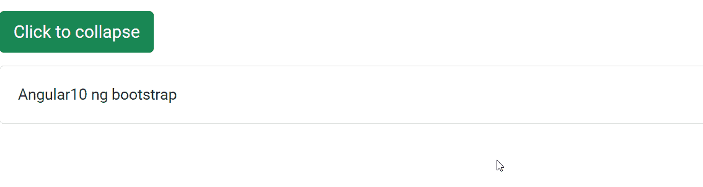

# 角度 ng 自举折叠组件

> 原文:[https://www . geesforgeks . org/angular-ng-bootstrap-collapse-component/](https://www.geeksforgeeks.org/angular-ng-bootstrap-collapse-component/)

Angular ng bootstrap 是一个 bootstrap 框架，与 Angular 一起使用来创建具有很好风格的组件，这个框架非常容易使用，用于制作响应性网站。

在本文中，我们将了解如何在角度引导中使用折叠。**折叠**用于制作一个按钮，点击该按钮即可折叠。

**安装语法:**

```
ng add @ng-bootstrap/ng-bootstrap
```

**进场:**

*   首先，使用上述命令安装 angular ng 引导程序。
*   在模块中导入引导模块

    ```
    import { NgbModule } from '@ng-bootstrap/ng-bootstrap';

    imports: [
      NgbModule
    ]

    ```

*   在 app.component.html 制造一个塌陷部件。
*   使用 ng serve 为应用提供服务。

**示例 1:** 在这个示例中，我们正在制作一个基本的折叠组件。

## app.component.html

```
<p>
  <br/>
  <button type="button"
          class="btn btn-success" 
          (click)="collapse.toggle()" 
          [attr.aria-expanded]="!gfg"
    aria-controls="collapseExample">
    Click to collapse
  </button>
</p>

<div #collapse="ngbCollapse" 
     [(ngbCollapse)]="gfg">
  <div class="card">
    <div class="card-body">
      Angular10 ng bootstrap
    </div>
  </div>
</div>
```

## app.module.ts

```
import { NgModule } from '@angular/core';

// Importing forms module
import { FormsModule, ReactiveFormsModule  }
from '@angular/forms';
import { BrowserModule } 
from '@angular/platform-browser';
import { BrowserAnimationsModule } 
from '@angular/platform-browser/animations';

import { AppComponent }  
from './app.component';
import { NgbModule }
from '@ng-bootstrap/ng-bootstrap';

@NgModule({
  bootstrap: [
    AppComponent
  ],
  declarations: [
    AppComponent
  ],
  imports: [
    FormsModule,
    BrowserModule,
    BrowserAnimationsModule,
    ReactiveFormsModule,
    NgbModule
  ]
})
export class AppModule { }
```

## app.component.ts

```
import { Component } from '@angular/core';

@Component({
    selector: 'app-root',
    templateUrl: './app.component.html',
    styleUrls: ['./app.component.css']
})
export class AppComponent {
    public gfg = false;
}
```

**输出:**



**示例 2:** 在本例中，我们已经预折叠了组件。

## app.component.html

```
<p>
  <br/>
  <button type="button"
          class="btn btn-success"
          (click)="collapse.toggle()"
          [attr.aria-expanded]="!gfg"
    aria-controls="collapseExample">
    Click to collapse
  </button>
</p>

<div #collapse="ngbCollapse"
     [(ngbCollapse)]="gfg">
  <div class="card">
    <div class="card-body">
      Angular10 ng bootstrap
    </div>
  </div>
</div>
```

## app.module.ts

```
import { NgModule } from '@angular/core';

// Importing forms module
import { FormsModule, ReactiveFormsModule  }
from '@angular/forms';
import { BrowserModule }
from '@angular/platform-browser';
import { BrowserAnimationsModule }
from '@angular/platform-browser/animations';

import { AppComponent }  
from './app.component';
import { NgbModule } 
from '@ng-bootstrap/ng-bootstrap';

@NgModule({
  bootstrap: [
    AppComponent
  ],
  declarations: [
    AppComponent
  ],
  imports: [
    FormsModule,
    BrowserModule,
    BrowserAnimationsModule,
    ReactiveFormsModule,
    NgbModule
  ]
})
export class AppModule { }
```

## app.component.ts

```
import { Component } from '@angular/core';

@Component({
    selector: 'app-root',
    templateUrl: './app.component.html',
    styleUrls: ['./app.component.css']
})
export class AppComponent {
    public gfg = true;
}
```

**输出:**


**参考:**[https://ng-bootstrap . github . io/#/components/collapse/examples](https://ng-bootstrap.github.io/#/components/collapse/examples)