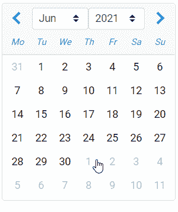

# 角度引导数据选择器组件

> 原文:[https://www . geesforgeks . org/angular-ng-bootstrap-date picker-component/](https://www.geeksforgeeks.org/angular-ng-bootstrap-datepicker-component/)

Angular ng bootstrap 是一个 bootstrap 框架，与 Angular 一起使用来创建具有很好风格的组件，这个框架非常容易使用，用于制作响应性网站。

在本文中，我们将看到如何在 angular ng bootstrap 中使用 Datepicker。**日期选择器**用于制作将使用日历显示的组件。

**安装语法:**

```ts
ng add @ng-bootstrap/ng-bootstrap
```

**进场:**

*   First, install the angular ng bootstrap using the above-mentioned command.

*   在 index.html

    > <link href="”https://maxcdn.bootstrapcdn.com/bootstrap/4.0.0/css/bootstrap.min.css”" rel="”stylesheet”">

    添加以下脚本
*   在模块中导入引导模块

    ```ts
    import { NgbModule } from '@ng-bootstrap/ng-bootstrap';

    imports: [
      NgbModule
    ]

    ```

*   在 app.component.html，制作一个日期选择器组件。
*   使用 ng serve 为应用提供服务。

**示例:**在本例中，我们制作了一个日期选择器的基本示例。

## app.component.html

```ts
<ngb-datepicker id='gfg'></ngb-datepicker>
```

## app.module.ts

```ts
import { NgModule } from '@angular/core';

// Importing forms module
import { FormsModule, ReactiveFormsModule  }
from '@angular/forms';
import { BrowserModule }
from '@angular/platform-browser';
import { BrowserAnimationsModule } 
from '@angular/platform-browser/animations';
import { AppComponent }   from './app.component';
import { NgbModule } from '@ng-bootstrap/ng-bootstrap';

@NgModule({
  bootstrap: [
    AppComponent
  ],
  declarations: [
    AppComponent
  ],
  imports: [
    FormsModule,
    BrowserModule,
    BrowserAnimationsModule,
    ReactiveFormsModule,
    NgbModule
  ]
})
export class AppModule { }
```

## app.component.css

```ts
#gfg{
    margin:40px
}
```

**输出:**



**参考:**[https://ng-bootstrap . github . io/#/components/date picker/overview](https://ng-bootstrap.github.io/#/components/datepicker/overview)