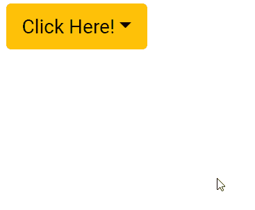

# 角度引导下拉组件

> 原文:[https://www . geesforgeks . org/angular-ng-bootstrap-drop-component/](https://www.geeksforgeeks.org/angular-ng-bootstrap-dropdown-component/)

Angular ng bootstrap 是一个 bootstrap 框架，与 Angular 一起使用来创建具有很好风格的组件，这个框架非常容易使用，用于制作响应性网站。

在本文中，我们将看到如何在 angular ng bootstrap 中使用 Dropdown。**下拉**用来制作一组对象，点击就会出来。

**安装语法:**

```ts
ng add @ng-bootstrap/ng-bootstrap
```

**进场:**

*   首先，使用上述命令安装 angular ng 引导程序。
*   在模块中导入引导模块

    ```ts
    import { NgbModule } from '@ng-bootstrap/ng-bootstrap';

    imports: [
      NgbModule
    ]

    ```

*   在 app.component.html，制作一个下拉组件。
*   使用 ng serve 为应用提供服务。

**示例 1:** 在本例中，我们使用的是基本的 ngbDropdown。

## app.component.html

```ts
<div class="col">
  <br/>
  <div ngbDropdown>
    <button class="btn btn-warning" id="gfg" 
            ngbDropdownToggle>Click Here!</button>
    <div ngbDropdownMenu="gfg">
      <button ngbDropdownItem>GeeksforGeeks</button>
      <button ngbDropdownItem>Angular10</button>
      <button ngbDropdownItem>ng bootstrap</button>
    </div>
  </div>
</div>
```

## app.module.ts

```ts
import { NgModule } from '@angular/core';

// Importing forms module
import { FormsModule, ReactiveFormsModule  } 
from '@angular/forms';
import { BrowserModule } 
from '@angular/platform-browser';
import { BrowserAnimationsModule } 
from '@angular/platform-browser/animations';

import { AppComponent }   from './app.component';
import { NgbModule }
from '@ng-bootstrap/ng-bootstrap';

@NgModule({
  bootstrap: [
    AppComponent
  ],
  declarations: [
    AppComponent
  ],
  imports: [
    FormsModule,
    BrowserModule,
    BrowserAnimationsModule,
    ReactiveFormsModule,
    NgbModule
  ]
})
export class AppModule { }
```

**输出:**



**示例 2:** 在本例中，我们使用的是放置在右上角的 ngbDropdown。

## app.component.html

```ts
<div class="col">
  <br/><br/><br/><br/>  

  <div ngbDropdown placement="top-right">
    <button class="btn btn-warning" id="gfg"
            ngbDropdownToggle>Click Here!</button>
    <div ngbDropdownMenu="gfg">
      <button ngbDropdownItem>GeeksforGeeks</button>
      <button ngbDropdownItem>Angular10</button>
      <button ngbDropdownItem>ng bootstrap</button>
    </div>
  </div>
</div>
```

## app.module.ts

```ts
import { NgModule } from '@angular/core';

// Importing forms module
import { FormsModule, ReactiveFormsModule  } 
from '@angular/forms';
import { BrowserModule } 
from '@angular/platform-browser';
import { BrowserAnimationsModule } 
from '@angular/platform-browser/animations';

import { AppComponent }   from './app.component';
import { NgbModule }
from '@ng-bootstrap/ng-bootstrap';

@NgModule({
  bootstrap: [
    AppComponent
  ],
  declarations: [
    AppComponent
  ],
  imports: [
    FormsModule,
    BrowserModule,
    BrowserAnimationsModule,
    ReactiveFormsModule,
    NgbModule
  ]
})
export class AppModule { }
```

## app.component.css

```ts
.col{
    margin: 50px;
}
```

**输出:**


**参考:**[https://ng-bootstrap . github . io/#/components/drop down/examples](https://ng-bootstrap.github.io/#/components/dropdown/examples)