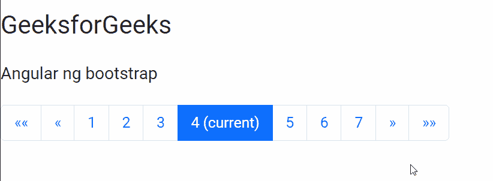
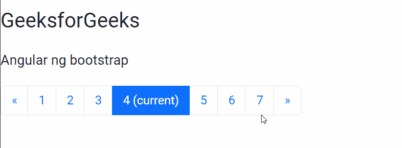

# 角度引导分页组件

> 原文:[https://www . geeksforgeeks . org/angular-ng-bootstrap-paging-component/](https://www.geeksforgeeks.org/angular-ng-bootstrap-pagination-component/)

Angular ng bootstrap 是一个 bootstrap 框架，与 Angular 一起使用来创建具有很好风格的组件，这个框架非常容易使用，用于制作响应性网站。

在本文中，我们将看到如何在 angular ng bootstrap 中使用分页。**分页**用于制作一组页面。

**安装语法:**

```
ng add @ng-bootstrap/ng-bootstrap
```

**进场:**

*   首先，使用上述命令安装 angular ng 引导程序。
*   在模块中导入引导模块

    ```
    import { NgbModule } from '@ng-bootstrap/ng-bootstrap';

    imports: [
      NgbModule
    ]

    ```

*   在 app.component.html 做一个分页组件。
*   使用 ng serve 为应用提供服务。

**示例 1:** 在本例中，我们使用边界链接进行分页。

## app.component.html

```
<br/>
<h1>GeeksforGeeks</h1>
<h3>Angular ng bootstrap</h3>
<ngb-pagination 
  [collectionSize]="70" 
  [(page)]="page" 
  [boundaryLinks]="true" >
</ngb-pagination>
```

## app.module.ts

```
import { NgModule } from '@angular/core';

// Importing forms module
import { FormsModule, ReactiveFormsModule  } 
from '@angular/forms';
import { BrowserModule }
from '@angular/platform-browser';
import { BrowserAnimationsModule } 
from '@angular/platform-browser/animations';

import { AppComponent }   from './app.component';
import { NgbModule } 
from '@ng-bootstrap/ng-bootstrap';

@NgModule({
  bootstrap: [
    AppComponent
  ],
  declarations: [
    AppComponent
  ],
  imports: [
    FormsModule,
    BrowserModule,
    BrowserAnimationsModule,
    ReactiveFormsModule,
    NgbModule
  ]
})
export class AppModule { }
```

## app.component.ts

```
import { Component } from '@angular/core';

@Component({
    selector: 'app-root',
    templateUrl: './app.component.html',
    styleUrls: ['./app.component.css']
})
export class AppComponent {
    page = 4;
}
```

**输出:**



**示例 2:** 在本例中，我们将带有边界链接的分页设置为 false。

## app.component.html

```
<br/>
<h1>GeeksforGeeks</h1>
<h3>Angular ng bootstrap</h3>
<ngb-pagination 
  [collectionSize]="70" 
  [(page)]="page"
  [boundaryLinks]="false" >
</ngb-pagination>
```

## app.module.ts

```
import { NgModule } from '@angular/core';

// Importing forms module
import { FormsModule, ReactiveFormsModule  } 
from '@angular/forms';
import { BrowserModule }
from '@angular/platform-browser';
import { BrowserAnimationsModule } 
from '@angular/platform-browser/animations';
import { AppComponent } 
from './app.component';
import { NgbModule } 
from '@ng-bootstrap/ng-bootstrap';

@NgModule({
  bootstrap: [
    AppComponent
  ],
  declarations: [
    AppComponent
  ],
  imports: [
    FormsModule,
    BrowserModule,
    BrowserAnimationsModule,
    ReactiveFormsModule,
    NgbModule
  ]
})
export class AppModule { }
```

## app.component.ts

```
import { Component } from '@angular/core';

@Component({
    selector: 'app-root',
    templateUrl: './app.component.html',
    styleUrls: ['./app.component.css']
})
export class AppComponent {
    page = 4;
}
```

**输出:**



**参考:**[https://ng-bootstrap . github . io/#/components/paging/overview](https://ng-bootstrap.github.io/#/components/pagination/overview)