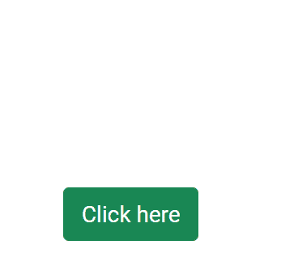
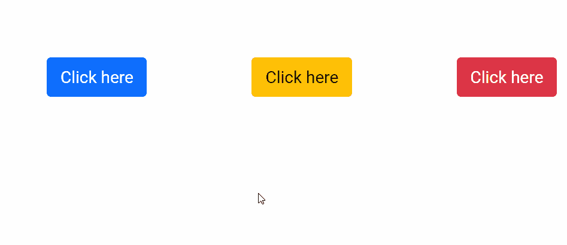

# 角度引导弹出组件

> 原文:[https://www . geesforgeks . org/angular-ng-bootstrap-popover-component/](https://www.geeksforgeeks.org/angular-ng-bootstrap-popover-component/)

Angular ng bootstrap 是一个 bootstrap 框架，与 Angular 一起使用来创建具有很好风格的组件，这个框架非常容易使用，用于制作响应性网站。

在本文中，我们将了解如何在 angular ng bootstrap 中使用 Popover。 **Popover** 用于制作一个按钮，点击后会弹出。

**安装语法:**

```ts
ng add @ng-bootstrap/ng-bootstrap
```

**进场:**

*   首先，使用上述命令安装 angular ng 引导程序。
*   在模块中导入引导模块

    ```ts
    import { NgbModule } from '@ng-bootstrap/ng-bootstrap';

    imports: [
      NgbModule
    ]

    ```

*   在 app.component.html 做一个 popover 组件。
*   使用 ng serve 为应用提供服务。

**示例 1:** 在本例中，我们制作了一个 popover，其位置位于顶部。

## app.component.html

```ts
<button id='gfg' type="button" 
    class="btn btn-success"
    placement="top"
    ngbPopover="Angular ng bootstrap" 
    popoverTitle="GeeksforGeeks">
    Click here
</button>
```

## app.module.ts

```ts
import { NgModule } from '@angular/core';

// Importing forms module
import { FormsModule, ReactiveFormsModule  } 
from '@angular/forms';
import { BrowserModule }
from '@angular/platform-browser';
import { BrowserAnimationsModule }
from '@angular/platform-browser/animations';

import { AppComponent }  
from './app.component';
import { NgbModule }
from '@ng-bootstrap/ng-bootstrap';

@NgModule({
  bootstrap: [
    AppComponent
  ],
  declarations: [
    AppComponent
  ],
  imports: [
    FormsModule,
    BrowserModule,
    BrowserAnimationsModule,
    ReactiveFormsModule,
    NgbModule
  ]
})
export class AppModule { }
```

## app.component.css

```ts
#gfg{
    margin-left: 100px;
    margin-top: 150px
}
```

**输出:**



**示例 2:** 在本例中，我们制作了一个 popover，其位置为底部、右侧、左侧。

## app.component.html

```ts
<button id='gfg' type="button" 
        class="btn btn-primary"
        placement="bottom"
        ngbPopover="Angular ng bootstrap"
        popoverTitle="GeeksforGeeks">
    Click here
</button>

<button id='gfg' type="button" 
        class="btn btn-warning" 
        placement="right"
        ngbPopover="Angular ng bootstrap"
        popoverTitle="GeeksforGeeks">
    Click here
</button>

<button id='gfg' type="button" 
        class="btn btn-danger" 
        placement="left"
        ngbPopover="Angular ng bootstrap"
        popoverTitle="GeeksforGeeks">
    Click here
</button>
```

## app.module.ts

```ts
import { NgModule } from '@angular/core';

// Importing forms module
import { FormsModule, ReactiveFormsModule  } 
from '@angular/forms';
import { BrowserModule } 
from '@angular/platform-browser';
import { BrowserAnimationsModule } 
from '@angular/platform-browser/animations';

import { AppComponent }  
from './app.component';
import { NgbModule } 
from '@ng-bootstrap/ng-bootstrap';

@NgModule({
  bootstrap: [
    AppComponent
  ],
  declarations: [
    AppComponent
  ],
  imports: [
    FormsModule,
    BrowserModule,
    BrowserAnimationsModule,
    ReactiveFormsModule,
    NgbModule
  ]
})
export class AppModule { }
```

## app.component.css

```ts
#gfg{
    margin-left: 100px;
    margin-top: 150px
}
```

**输出:**



**参考:**[https://ng-bootstrap . github . io/#/components/popover/examples](https://ng-bootstrap.github.io/#/components/popover/examples)