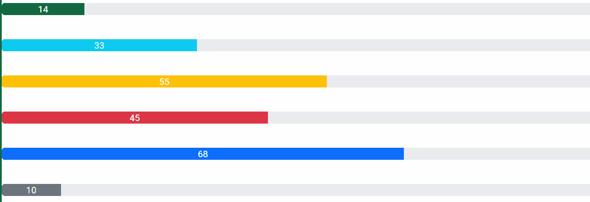
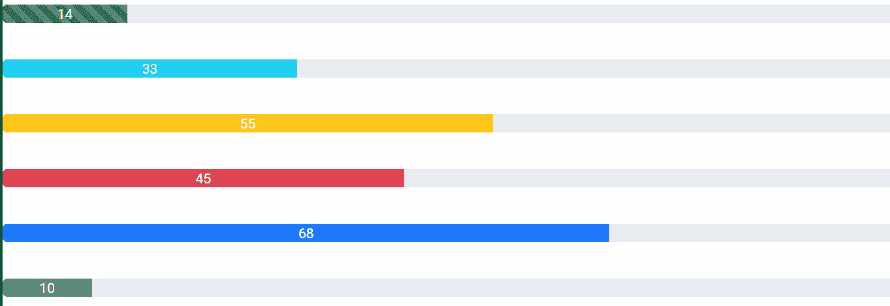

# 角度 ng 自举进度条组件

> 原文:[https://www . geesforgeks . org/angular-ng-bootstrap-progress bar-component/](https://www.geeksforgeeks.org/angular-ng-bootstrap-progressbar-component/)

Angular ng bootstrap 是一个 bootstrap 框架，与 Angular 一起使用来创建具有很好风格的组件，这个框架非常容易使用，用于制作响应性网站。

在本文中，我们将看到如何在 angular ng bootstrap 中使用 Progressbar。**进度栏**组件用于提供工作进度的最新反馈。

**安装语法:**

```
ng add @ng-bootstrap/ng-bootstrap
```

**进场:**

*   首先，使用上述命令安装 angular ng 引导程序。
*   在模块中导入引导模块

    ```
    import { NgbModule } from '@ng-bootstrap/ng-bootstrap';

    imports: [
        NgbModule
    ]

    ```

*   在 app.component.html，制作一个 progressbar 组件。
*   使用 ng serve 为应用提供服务。

**示例 1:** 在这个示例中，我们正在制作 progressbar 的基本示例。

## app.component.html

```
<br/>
<p><ngb-progressbar type="success" [value]="14">
    14
</ngb-progressbar></p>
<br/>

<p><ngb-progressbar type="info" [value]="33">
    33
</ngb-progressbar></p>
<br/>

<p><ngb-progressbar type="warning" [value]="55">
    55
</ngb-progressbar></p>
<br/>

<p><ngb-progressbar type="danger" [value]="45">
    45
</ngb-progressbar></p>
<br/>

<p><ngb-progressbar type="primary" [value]="68">
    68
</ngb-progressbar></p>
<br/>

<p><ngb-progressbar type="secondary" [value]="10">
    10
</ngb-progressbar></p>
```

## app.module.ts

```
import { NgModule } from '@angular/core';

// Importing forms module
import { FormsModule, ReactiveFormsModule  }
from '@angular/forms';
import { BrowserModule }
from '@angular/platform-browser';
import { BrowserAnimationsModule } 
from '@angular/platform-browser/animations';

import { AppComponent }   from './app.component';
import { NgbModule }
from '@ng-bootstrap/ng-bootstrap';

@NgModule({
  bootstrap: [
    AppComponent
  ],
  declarations: [
    AppComponent
  ],
  imports: [
    FormsModule,
    BrowserModule,
    BrowserAnimationsModule,
    ReactiveFormsModule,
    NgbModule

  ]
})
export class AppModule { }
```

**输出:**



**示例 2:** 在本例中，我们正在制作一个条纹和动画设置为 true 的进度条。

## app.component.html

```
<br/>

<p><ngb-progressbar 
    type="success" 
    [value]="14" 
    [striped]="true" 
    [animated]="true" >14
</ngb-progressbar></p>
<br/>

<p><ngb-progressbar 
    type="info"
    [value]="33" 
    [striped]="true" 
    [animated]="true" >33
</ngb-progressbar></p>
<br/>

<p><ngb-progressbar 
    type="warning"
    [value]="55"
    [striped]="true" 
    [animated]="true" >55
</ngb-progressbar></p>
<br/>

<p><ngb-progressbar 
    type="danger" 
    [value]="45"
    [striped]="true" 
    [animated]="true" >45
</ngb-progressbar></p>
<br/>

<p><ngb-progressbar 
    type="primary" 
    [value]="68" 
    [striped]="true" 
    [animated]="true" >68
</ngb-progressbar></p>
<br/>

<p><ngb-progressbar 
    type="secondary"
    [value]="10" 
    [striped]="true" 
    [animated]="true" >10
</ngb-progressbar></p>
```

## app.module.ts

```
import { NgModule } from '@angular/core';

// Importing forms module
import { FormsModule, ReactiveFormsModule  } 
from '@angular/forms';
import { BrowserModule }
from '@angular/platform-browser';
import { BrowserAnimationsModule } 
from '@angular/platform-browser/animations';

import { AppComponent }  
from './app.component';
import { NgbModule }
from '@ng-bootstrap/ng-bootstrap';

@NgModule({
  bootstrap: [
    AppComponent
  ],
  declarations: [
    AppComponent
  ],
  imports: [
    FormsModule,
    BrowserModule,
    BrowserAnimationsModule,
    ReactiveFormsModule,
    NgbModule

  ]
})
export class AppModule { }
```

**输出:**



**参考:**[**https://ng-bootstrap . github . io/#/components/progress bar/examples**](https://ng-bootstrap.github.io/#/components/progressbar/examples)