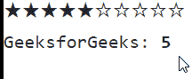
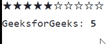

# 角度引导额定值组件

> 原文:[https://www . geesforgeks . org/angular-ng-bootstrap-rating-component/](https://www.geeksforgeeks.org/angular-ng-bootstrap-rating-component/)

Angular ng bootstrap 是一个 bootstrap 框架，与 Angular 一起使用来创建具有很好风格的组件，这个框架非常容易使用，用于制作响应性网站。

在本文中，我们将看到如何在角度引导中使用评级。**评级**组件用于制作一个组件，该组件将使用星号显示。

**安装语法:**

```
ng add @ng-bootstrap/ng-bootstrap
```

**进场:**

*   First, install the angular ng bootstrap using the above-mentioned command.

*   在 index.html

    > <link href="”https://maxcdn.bootstrapcdn.com/bootstrap/4.0.0/css/bootstrap.min.css”" rel="”stylesheet”">

    添加以下脚本
*   在模块中导入引导模块

    ```
    import { NgbModule } from '@ng-bootstrap/ng-bootstrap';

    imports: [
      NgbModule
    ]

    ```

*   在 app.component.html，进行评级。
*   使用 ng serve 为应用提供服务。

**示例 1:** 在这个示例中，我们正在制作评级的基本示例。

## app.component.html

```
<ngb-rating [(rate)]="gfg"></ngb-rating> 
<pre>GeeksforGeeks: <b>{{gfg}}</b></pre>
```

## app.module.ts

```
import { NgModule } from '@angular/core';

// Importing forms module
import { FormsModule, ReactiveFormsModule  }
from '@angular/forms';
import { BrowserModule } 
from '@angular/platform-browser';
import { BrowserAnimationsModule } 
from '@angular/platform-browser/animations';

import { AppComponent }   from './app.component';
import { NgbModule }
from '@ng-bootstrap/ng-bootstrap';

@NgModule({
  bootstrap: [
    AppComponent
  ],
  declarations: [
    AppComponent
  ],
  imports: [
    FormsModule,
    BrowserModule,
    BrowserAnimationsModule,
    ReactiveFormsModule,
    NgbModule

  ]
})
export class AppModule { }
```

## app.component.ts

```
import { Component } from '@angular/core';

@Component({
    selector: 'app-root',
    templateUrl: './app.component.html',
    styleUrls: ['./app.component.css']
})
export class AppComponent {
    gfg = 5;

}
```

**输出:**



**示例 2:** 在本例中，我们将评级设置为只读。

## app.component.html

```
<ngb-rating [(rate)]="gfg" [readonly]='true'></ngb-rating>
<pre>GeeksforGeeks: <b>{{gfg}}</b></pre>
```

## app.module.ts

```
import { NgModule } from '@angular/core';

// Importing forms module
import { FormsModule, ReactiveFormsModule  } 
from '@angular/forms';
import { BrowserModule } 
from '@angular/platform-browser';
import { BrowserAnimationsModule } 
from '@angular/platform-browser/animations';

import { AppComponent }   from './app.component';
import { NgbModule }
from '@ng-bootstrap/ng-bootstrap';

@NgModule({
  bootstrap: [
    AppComponent
  ],
  declarations: [
    AppComponent
  ],
  imports: [
    FormsModule,
    BrowserModule,
    BrowserAnimationsModule,
    ReactiveFormsModule,
    NgbModule

  ]
})
export class AppModule { }
```

## app.component.ts

```
import { Component } from '@angular/core';

@Component({
    selector: 'app-root',
    templateUrl: './app.component.html',
    styleUrls: ['./app.component.css']
})
export class AppComponent {
    gfg = 5;

}
```

**输出:**



**参考:**T2】https://ng-bootstrap.github.io/#/components/rating/examples