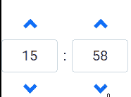
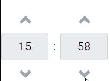

# 角度 ng 自举计时器组件

> 原文:[https://www . geeksforgeeks . org/angular-ng-bootstrap-time picker-component/](https://www.geeksforgeeks.org/angular-ng-bootstrap-timepicker-component/)

Angular ng bootstrap 是一个 bootstrap 框架，与 Angular 一起使用来创建具有很好风格的组件，这个框架非常容易使用，用于制作响应性网站。
在本文中，我们将了解如何在 angular ng bootstrap 中使用 Timepicker。

**安装语法:**

```ts
ng add @ng-bootstrap/ng-bootstrap
```

**进场:**

*   首先，使用上述命令安装 angular ng 引导程序。
*   在 index.html

    > <link href="”https://maxcdn.bootstrapcdn.com/bootstrap/4.0.0/css/bootstrap.min.css”" rel="”stylesheet”">

    添加以下脚本
*   在模块中导入引导模块

    ```ts
    import { NgbModule } from '@ng-bootstrap/ng-bootstrap';

    imports: [ 
        NgbModule 
    ]

    ```

*   在 app.component.html，制作一个更精致的组件。
*   使用 ng serve 为应用提供服务

**示例 1:** 在这个示例中，我们正在制作 timepicker 的基本示例。

## app.component.html

```ts
<ngb-timepicker id='gfg' [(ngModel)]="gfg1"></ngb-timepicker>
```

## app.module.ts

```ts
import { NgModule } from '@angular/core';

// Importing forms module
import { FormsModule, ReactiveFormsModule  }
from '@angular/forms';
import { BrowserModule } 
from '@angular/platform-browser';
import { BrowserAnimationsModule } 
from '@angular/platform-browser/animations';

import { AppComponent }   from './app.component';
import { NgbModule } from '@ng-bootstrap/ng-bootstrap';

@NgModule({
  bootstrap: [
    AppComponent
  ],
  declarations: [
    AppComponent
  ],
  imports: [
    FormsModule,
    BrowserModule,
    BrowserAnimationsModule,
    ReactiveFormsModule,
    NgbModule
  ]
})
export class AppModule { }
```

## app.component.css

```ts
#gfg {
    margin:40px
}
```

## app.component.ts

```ts
import { Component } from '@angular/core';

@Component({
    selector: 'app-root',
    templateUrl: './app.component.html',
    styleUrls: ['./app.component.css']
})
export class AppComponent {
    gfg1 = {hour: 15, minute: 58};

}
```

**输出:**



**示例 2:** 在本例中，我们正在制作一个禁用的 timepicker。

## app.component.html

```ts
<ngb-timepicker id='gfg' 
    [(ngModel)]="gfg1" [disabled]='true'>
</ngb-timepicker>
```

## app.module.ts

```ts
import { NgModule } from '@angular/core';

// Importing forms module
import { FormsModule, ReactiveFormsModule  }
from '@angular/forms';
import { BrowserModule } 
from '@angular/platform-browser';
import { BrowserAnimationsModule }
from '@angular/platform-browser/animations';

import { AppComponent } 
from './app.component';
import { NgbModule }
from '@ng-bootstrap/ng-bootstrap';

@NgModule({
  bootstrap: [
    AppComponent
  ],
  declarations: [
    AppComponent
  ],
  imports: [
    FormsModule,
    BrowserModule,
    BrowserAnimationsModule,
    ReactiveFormsModule,
    NgbModule
  ]
})
export class AppModule { }
```

## app.component.css

```ts
#gfg {
    margin:40px
}
```

## app.component.ts

```ts
import { Component } from '@angular/core';

@Component({
    selector: 'app-root',
    templateUrl: './app.component.html',
    styleUrls: ['./app.component.css']
})
export class AppComponent {
    gfg1 = {hour: 15, minute: 58};

}
```

**输出:**



**参考:**[https://ng-bootstrap . github . io/#/components/time picker/examples](https://ng-bootstrap.github.io/#/components/timepicker/examples)