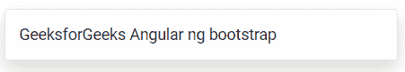
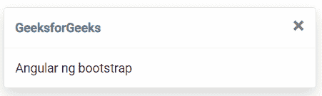

# 角度 ng 自举吐司组件

> 原文:[https://www . geesforgeks . org/angular-ng-bootstrap-toast-component/](https://www.geeksforgeeks.org/angular-ng-bootstrap-toast-component/)

Angular ng bootstrap 是一个 bootstrap 框架，与 Angular 一起使用来创建具有很好风格的组件，这个框架非常容易使用，用于制作响应性网站。
在本文中，我们将看到如何在 angular ng bootstrap 中使用 Toast。Toast 组件用于制作向用户提供反馈消息的组件。

**安装语法:**

```ts
ng add @ng-bootstrap/ng-bootstrap
```

**进场:**

*   首先，使用上述命令安装 angular ng 引导程序。
*   在 index.html

    > <link href="”https://maxcdn.bootstrapcdn.com/bootstrap/4.0.0/css/bootstrap.min.css”" rel="”stylesheet”">

    添加以下脚本
*   在模块中导入引导模块

    ```ts
    import { NgbModule } from '@ng-bootstrap/ng-bootstrap';
    imports: [ 
        NgbModule
    ]

    ```

*   在 app.component.html 做一个吐司组件。
*   使用 ng serve 为应用提供服务。

**示例 1:** 在这个示例中，我们正在制作吐司的基本示例。

## app.component.html

```ts
<ngb-toast [autohide]="false" id='gfg'>
    GeeksforGeeks Angular ng bootstrap
</ngb-toast>
```

## app.module.ts

```ts
import { NgModule } from '@angular/core';

// Importing forms module
import { FormsModule, ReactiveFormsModule  } 
from '@angular/forms';
import { BrowserModule } 
from '@angular/platform-browser';
import { BrowserAnimationsModule }
from '@angular/platform-browser/animations';

import { AppComponent }   from './app.component';
import { NgbModule }
from '@ng-bootstrap/ng-bootstrap';

@NgModule({
  bootstrap: [
    AppComponent
  ],
  declarations: [
    AppComponent
  ],
  imports: [
    FormsModule,
    BrowserModule,
    BrowserAnimationsModule,
    ReactiveFormsModule,
    NgbModule
  ]
})
export class AppModule { }
```

## app.component.css

```ts
#gfg {
    margin:40px
}
```

**输出:**



**例 2:** 在这个例子中，我们正在用 header 做吐司。

## app.component.html

```ts
<ngb-toast [autohide]="false" id='gfg' header='GeeksforGeeks'>
    Angular ng bootstrap
</ngb-toast>
```

## app.module.ts

```ts
import { NgModule } from '@angular/core';

// Importing forms module
import { FormsModule, ReactiveFormsModule  }
from '@angular/forms';
import { BrowserModule } 
from '@angular/platform-browser';
import { BrowserAnimationsModule }
from '@angular/platform-browser/animations';

import { AppComponent }   from './app.component';
import { NgbModule }
from '@ng-bootstrap/ng-bootstrap';

@NgModule({
  bootstrap: [
    AppComponent
  ],
  declarations: [
    AppComponent
  ],
  imports: [
    FormsModule,
    BrowserModule,
    BrowserAnimationsModule,
    ReactiveFormsModule,
    NgbModule
  ]
})
export class AppModule { }
```

## app.component.css

```ts
#gfg {
    margin:40px
}
```

**输出:**



**参考:**T2】https://ng-bootstrap.github.io/#/components/toast/overview