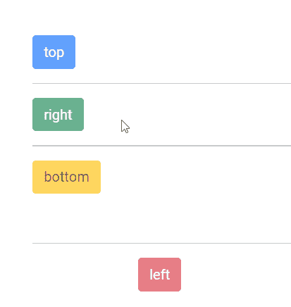

# 角度引导工具提示组件

> 原文:[https://www . geesforgeks . org/angular-ng-bootstrap-tooltip-component/](https://www.geeksforgeeks.org/angular-ng-bootstrap-tooltip-component/)

Angular ng bootstrap 是一个 bootstrap 框架，与 Angular 一起使用来创建具有很好风格的组件，这个框架非常容易使用，用于制作响应性网站。在本文中，我们将了解如何在 angular ng bootstrap 中使用 Tooltip。

**工具提示**用于当用户将鼠标悬停在某个元素上、聚焦在该元素上或点击该元素时显示信息性文本。

**安装语法:**

```ts
ng add @ng-bootstrap/ng-bootstrap
```

**进场:**

*   First, install the angular ng bootstrap using the above-mentioned command.

*   在 index.html

    > <link href="”https://maxcdn.bootstrapcdn.com/bootstrap/4.0.0/css/bootstrap.min.css”" rel="”stylesheet”">

    添加以下脚本
*   在

    > 模块中导入引导模块从" @ng-bootstrap/ng-bootstrap "导入{ NGB 模块}；
    > 
    > 进口:[
    > NGB 模块
    > 】

*   在 app.component.html 制作一个工具提示组件。
*   使用 ng serve 为应用提供服务。

**示例 1:** 在这个示例中，我们正在制作工具提示的基本示例。

## app.component.html

```ts
<div id='geeks'>

    <br /><br /><br />

    <button type="button" 
        class="btn btn-primary" 
        placement="top" 
        ngbTooltip="GeeksforGeeks">
        top
    </button>
    <hr>

    <button type="button" 
        class="btn btn-success" 
        placement="right" 
        ngbTooltip="GeeksforGeeks">
        right
    </button>
    <hr>

    <button type="button" 
        class="btn btn-warning" 
        placement="bottom" 
        ngbTooltip="GeeksforGeeks">
        bottom
    </button>

    <br /><br /><br />
    <hr>

    <button id='gfg' type="button" 
        class="btn btn-danger" 
        placement="left" 
        ngbTooltip="GeeksforGeeks">
        left
    </button>
</div>
```

## app.module.ts

```ts
import { NgModule } from '@angular/core';

// Importing forms module
import { FormsModule, ReactiveFormsModule } from '@angular/forms';
import { BrowserModule } from '@angular/platform-browser';
import { BrowserAnimationsModule } from
    '@angular/platform-browser/animations';

import { AppComponent } from './app.component';
import { NgbModule } from '@ng-bootstrap/ng-bootstrap';

@NgModule({
    bootstrap: [
        AppComponent
    ],
    declarations: [
        AppComponent
    ],
    imports: [
        FormsModule,
        BrowserModule,
        BrowserAnimationsModule,
        ReactiveFormsModule,
        NgbModule

    ]
})
export class AppModule { }
```

## app.component.css

```ts
#gfg {
    margin-left:120px
}
#geeks {
    margin-left:40px
}
```

**输出:**


**例 2:** 在这个例子中，我们在做一个有头的吐司。

## app.component.html

```ts
<div id='geeks'>
    <br /><br /><br />

    <button type="button" 
        class="btn btn-primary" 
        [disabled]='true' 
        placement="top" 
        ngbTooltip="GeeksforGeeks">
        top
    </button>
    <hr>

    <button type="button" 
        class="btn btn-success" 
        [disabled]='true' 
        placement="right" 
        ngbTooltip="GeeksforGeeks">
        right
    </button>
    <hr>

    <button type="button" 
        class="btn btn-warning" 
        [disabled]='true' 
        placement="bottom" 
        ngbTooltip="GeeksforGeeks">
        bottom
    </button>

    <br /><br /><br />
    <hr>

    <button id='gfg' type="button" 
        class="btn btn-danger" 
        [disabled]='true'
        placement="left" 
        ngbTooltip="GeeksforGeeks">
        left
    </button>
</div>
```

## app.module.ts

```ts
import { NgModule } from '@angular/core';

// Importing forms module
import { FormsModule, ReactiveFormsModule } from '@angular/forms';
import { BrowserModule } from '@angular/platform-browser';
import { BrowserAnimationsModule } from
    '@angular/platform-browser/animations';

import { AppComponent } from './app.component';
import { NgbModule } from '@ng-bootstrap/ng-bootstrap';

@NgModule({
    bootstrap: [
        AppComponent
    ],
    declarations: [
        AppComponent
    ],
    imports: [
        FormsModule,
        BrowserModule,
        BrowserAnimationsModule,
        ReactiveFormsModule,
        NgbModule

    ]
})
export class AppModule { }
```

## app.component.css

```ts
#gfg {
    margin-left:120px
}
#geeks {
    margin-left:40px
}
```

**输出:**



**参考:**[https://ng-bootstrap . github . io/#/components/type ahead/examples](https://ng-bootstrap.github.io/#/components/typeahead/examples)