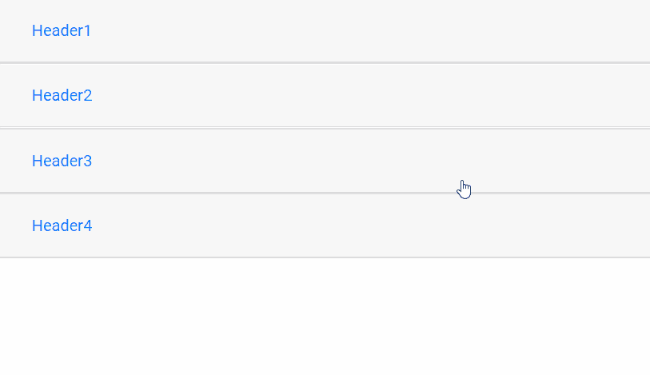

# Angular ngx 自举手风琴组件

> 原文:[https://www . geesforgeks . org/angular-ngx-bootstrap-accordion-component/](https://www.geeksforgeeks.org/angular-ngx-bootstrap-accordion-component/)

Angular ngx bootstrap 是一个 bootstrap 框架，与 Angular 一起使用来创建具有很好风格的组件，这个框架非常容易使用，并且用于制作响应性网站。

在本文中，我们将了解如何在 angular ngx bootstrap 中使用手风琴。**手风琴**用于显示可折叠的内容，在有限的空间内呈现信息。

**安装语法:**

```ts
npm install ngx-bootstrap --save
```

**进场:**

*   First, install the angular ngx bootstrap using the above-mentioned command.
*   在 index.html

    > <link href="”https://maxcdn.bootstrapcdn.com/bootstrap/4.0.0/css/bootstrap.min.css”" rel="”stylesheet”">

    添加以下脚本
*   在模块中导入手风琴组件
*   在 app.component.html 制作手风琴组件。
*   使用 ng serve 为应用提供服务。

**例 1:**

## index.html

```ts
<!doctype html>
<html lang="en">

<head>
    <meta charset="utf-8">
    <base href="/">
    <meta name="viewport" content=
        "width=device-width, initial-scale=1">
    <link href=
"https://maxcdn.bootstrapcdn.com/bootstrap/4.0.0/css/bootstrap.min.css"
        rel="stylesheet">

    <link rel="icon" type="image/x-icon" href="favicon.ico">
    <link rel="preconnect" href="https://fonts.gstatic.com">
    <link href=
"https://fonts.googleapis.com/css2?family=Roboto:wght@300;400;500&display=swap"
        rel="stylesheet">
    <link href="https://fonts.googleapis.com/icon?family=Material+Icons"
        rel="stylesheet">
</head>

<body class="mat-typography">
    <app-root></app-root>
</body>

</html>
```

## app.component.html

```ts
<accordion [isAnimated]="true">
    <accordion-group heading="Header1">
        <p>content1</p>
    </accordion-group>

    <accordion-group heading="Header2">
        <p>content2</p>
    </accordion-group>

    <accordion-group heading="Header3">
        <p>content3</p>
    </accordion-group>

    <accordion-group heading="Header4">
        <p>content4</p>
    </accordion-group>
</accordion>
```

## app.module.ts

```ts
import { NgModule } from '@angular/core';

// Importing forms module
import { FormsModule, ReactiveFormsModule }
    from '@angular/forms';
import { BrowserModule }
    from '@angular/platform-browser';
import { BrowserAnimationsModule }
    from '@angular/platform-browser/animations';
import { AccordionModule }
    from 'ngx-bootstrap/accordion';

import { AppComponent }
    from './app.component';

@NgModule({
    bootstrap: [
        AppComponent
    ],
    declarations: [
        AppComponent
    ],
    imports: [
        FormsModule,
        BrowserModule,
        BrowserAnimationsModule,
        ReactiveFormsModule,
        AccordionModule.forRoot()
    ]
})
export class AppModule { }
```

**输出:**



**参考:**T2】https://valor-software.com/ngx-bootstrap/#/accordion