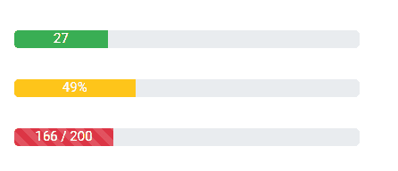

# 角度 ngx 自举进度条组件

> 原文:[https://www . geesforgeks . org/angular-ngx-bootstrap-progress bar-component/](https://www.geeksforgeeks.org/angular-ngx-bootstrap-progressbar-component/)

Angular ngx bootstrap 是一个 bootstrap 框架，与 Angular 一起使用，创建具有很好风格的组件，这个框架非常容易使用，用于制作响应性网站。

在本文中，我们将了解如何在 angular ngx bootstrap 中使用 Progressbar。 **Progressbar** 用于提供工作进度的最新反馈。

**安装语法:**

```
npm install ngx-bootstrap --save
```

**进场:**

*   First, install the angular ngx bootstrap using the above-mentioned command.

*   在 index.html

    > <link href="”https://maxcdn.bootstrapcdn.com/bootstrap/4.0.0/css/bootstrap.min.css”" rel="”stylesheet”">

    添加以下脚本
*   在模块中导入 progressbar 组件。ts
*   在 app.component.html 做一个进度条组件。
*   使用 ng serve 为应用提供服务。

**示例:**

## index.html

```
<!DOCTYPE html>
<html lang="en">

<head>
    <meta charset="utf-8" />
    <base href="/" />
    <meta name="viewport" content=
        "width=device-width, initial-scale=1" />
    <link href=
"https://maxcdn.bootstrapcdn.com/bootstrap/4.0.0/css/bootstrap.min.css"
        rel="stylesheet" />

    <link rel="icon" type="image/x-icon" href="favicon.ico" />
    <link rel="preconnect" href="https://fonts.gstatic.com" />
    <link href=
"https://fonts.googleapis.com/css2?family=Roboto:wght@300;400;500&display=swap"
        rel="stylesheet" />
    <link href="https://fonts.googleapis.com/icon?family=Material+Icons" 
        rel="stylesheet" />
</head>

<body class="mat-typography">
    <app-root></app-root>
</body>

</html>
```

## app.component.html

```
<div class="column">
    <div class="col-sm-4">
        <div class="mb-2">
            <progressbar [max]="100" [value]="27" 
                type="success" [striped]="true" 
                [animate]="true">27
            </progressbar>
        </div>
    </div>

    <br />

    <div class="col-sm-4">
        <div class="mb-2">
            <progressbar [max]="140" [value]="49" 
                type="warning" [animate]="true" 
                [striped]="true">49%
            </progressbar>
        </div>
    </div>

    <br />

    <div class="col-sm-4">
        <div class="mb-2">
            <progressbar [max]="140" [value]="40" 
                type="danger" [striped]="true" 
                [animate]="true">
                166 / 200
            </progressbar>
        </div>
    </div>
</div>
```

## app.module.ts

```
import { NgModule } from '@angular/core';

// Importing forms module
import { FormsModule, ReactiveFormsModule }
    from '@angular/forms';
import { BrowserModule }
    from '@angular/platform-browser';
import { BrowserAnimationsModule }
    from '@angular/platform-browser/animations';
import { ProgressbarModule }
    from 'ngx-bootstrap/progressbar';

import { AppComponent } from './app.component';

@NgModule({
    bootstrap: [
        AppComponent
    ],
    declarations: [
        AppComponent
    ],
    imports: [
        FormsModule,
        BrowserModule,
        BrowserAnimationsModule,
        ReactiveFormsModule,
        ProgressbarModule.forRoot()
    ]
})
export class AppModule { }
```

## app.component.css

```
.column{
    margin: 30px;
}
```

## app.component.ts

```
import { Component, OnInit,LOCALE_ID } from '@angular/core';

@Component({
    selector: 'app-root',
    templateUrl: './app.component.html',
    styleUrls: ['./app.component.css']
})
export class AppComponent {
}
```

**输出:**



**参考:**T2】https://valor-software.com/ngx-bootstrap/progressbar